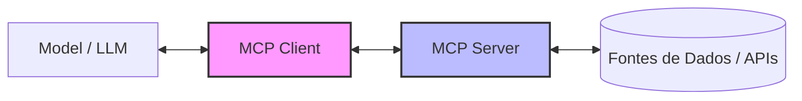

# Aula 01 - Introdução ao MCP e Arquiteturas de IA 🌐

!!! tip "Objetivo"
    **Objetivo**: Compreender a evolução dos modelos de linguagem (LLMs), os desafios de integração e o surgimento do Model Context Protocol (MCP) como solução padrão para o ecossistema de IA.

---

## 1. Evolução dos LLMs e o Problema do Contexto 🧠

Os modelos de linguagem evoluíram de simples geradores de texto para assistentes capazes de raciocinar. No entanto, eles sofrem de um problema crítico: **isolamento de dados**.

*   **Modelos Iniciais**: Conhecimento estático (treinados em dados passados).
*   **RAG (Retrieval-Augmented Generation)**: Permitiu que modelos "lessem" documentos em tempo real.
*   **Agents**: IAs que podem executar ações (ex: enviar e-mails, pesquisar na web).

### 📉 O Desafio da Integração
Cada aplicação de IA hoje precisa construir suas próprias "pontes" para cada ferramenta externa (bancos de dados, Slack, GitHub, etc.). Isso gera fragmentação e insegurança.

---

## 2. O que é o Model Context Protocol (MCP)? 🏗️

O **Model Context Protocol (MCP)** é um protocolo aberto, iniciado pela Anthropic, que permite que modelos de IA se conectem de forma integrada a fontes de dados e ferramentas externas.

!!! concept "Conceito Chave"
    O MCP funciona como o **"USB para IAs"**. Assim como o padrão USB permite conectar qualquer mouse a qualquer computador, o MCP permite conectar qualquer servidor de dados a qualquer modelo de IA compatível.

### Arquitetura de Alto Nível (Mermaid)



---

## 3. Por que precisamos de um Protocolo? 📡

Um protocolo é um conjunto de regras que define como dois sistemas se comunicam. Sem o MCP:

1.  **Redundância**: Desenvolvedores precisam escrever código de integração repetido.
2.  **Insegurança**: Cada integração tem seu próprio modelo de permissões (ou falta dele).
3.  **Complexidade**: Mudar de modelo (ex: de GPT para Claude) exige refazer integrações.

---

## 4. Casos de Uso no Mercado 🚀

O MCP já está sendo adotado em diversos cenários:

*   **IDEs Inteligentes**: Conectar seu editor de código (VS Code, Cursor) diretamente aos seus logs de servidor ou documentação interna.
*   **Assistentes Financeiros**: IAs que podem consultar saldos e transações via APIs bancárias estruturadas.
*   **Suporte ao Cliente**: Agentes que acessam o CRM e histórico de tickets de forma padronizada.

---

## 5. Visualizando o MCP no Terminal 💻

Podemos ver o MCP em ação através de ferramentas de inspeção.

```termynal
$ mcp-inspect list-tools
[INFO] Conectando ao servidor MCP local...
[SUCCESS] 3 ferramentas encontradas:
- get_weather: Obtém clima atual.
- search_docs: Pesquisa na base de conhecimento.
- execute_sql: Executa queries em banco de dados.

$ mcp-inspect call get_weather --city "São Paulo"
[INFO] Chamando ferramenta get_weather...
[RESULT] Clima em São Paulo: 25°C, Ensolarado.
```

---

## 6. Mini-Projeto: Explorando Clientes MCP 🧪

Sua primeira tarefa prática é explorar o ecossistema:

1.  Baixe o **Claude Desktop** (o primeiro cliente MCP de referência).
2.  Acesse as configurações do MCP para entender como servidores são registrados.
3.  Pesquise no [MCP Directory](https://mcp-directory.com) por servidores existentes (PostgreSQL, Slack, Google Drive).

---

## 7. Exercícios de Fixação 📝

1.  Explique a analogia do "USB para IAs" aplicada ao MCP.
2.  Diferencie um **MCP Client** de um **MCP Server**.
3.  Cite três problemas que o MCP visa resolver no desenvolvimento de aplicações de IA.

---

!!! info "Dica"
    O MCP não é apenas para o Claude; é um padrão que está sendo adotado por diversas empresas de IA.

**Próxima Aula**: [Fundamentos de Protocolos e APIs](./aula-02.md) 📡
