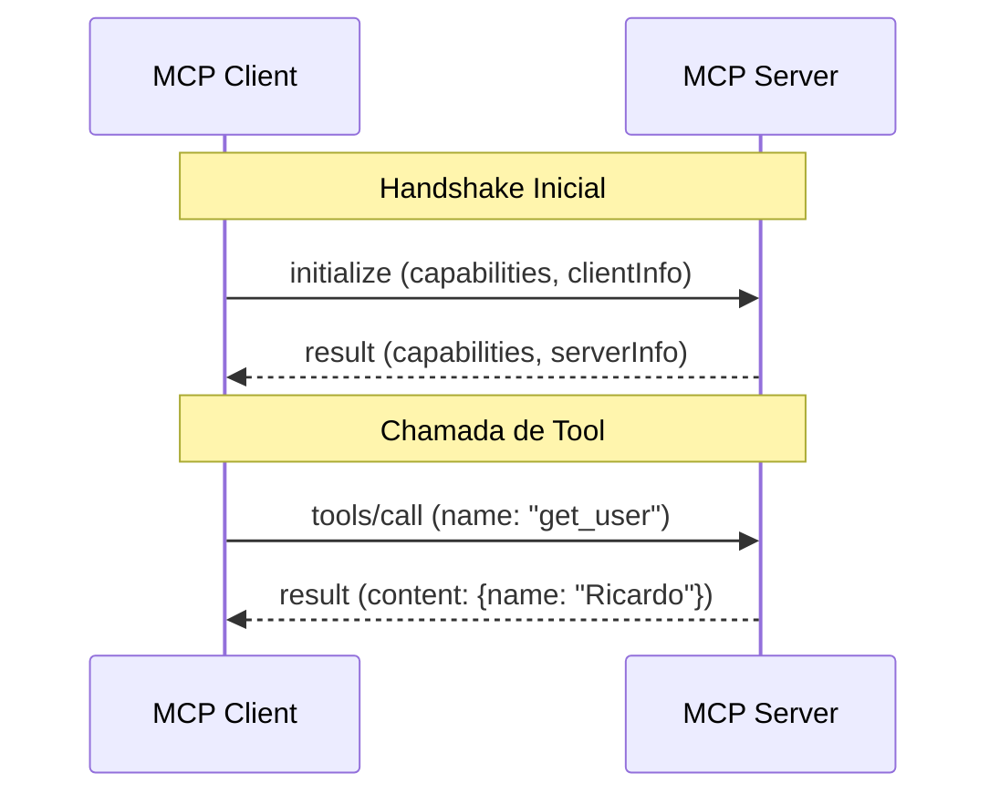

# Aula 02 - Fundamentos de Protocolos e APIs 📡

!!! tip "Objetivo"
    **Objetivo**: Entender as bases técnicas sobre as quais o MCP é construído, incluindo protocolos de comunicação, formatos de dados (JSON) e contratos de interface.

---

## 1. Protocolos de Comunicação: REST, RPC e WebSockets 🔌

Para que dois sistemas conversem, eles precisam de um "idioma" comum.

*   **REST (Representational State Transfer)**: O padrão web. Usa métodos HTTP (GET, POST, etc.) para manipular recursos.
*   **RPC (Remote Procedure Call)**: Focado em chamar funções em outro computador como se fossem locais. O MCP utiliza **JSON-RPC**.
*   **WebSockets**: Permite comunicação bi-direcional e em tempo real. Ideal para fluxos contínuos de IA.

---

## 2. A Estrutura de Mensagens JSON 📄

O MCP utiliza JSON (**JavaScript Object Notation**) para transportar dados por ser leve e legível tanto por humanos quanto por máquinas.

### Exemplo de Mensagem JSON-RPC (MCP)

```json
{
  "jsonrpc": "2.0",
  "method": "tools/call",
  "params": {
    "name": "calc_tax",
    "arguments": {
      "amount": 1000,
      "state": "SP"
    }
  },
  "id": 1
}
```

---

## 3. Autenticação e Autorização 🔐

Segurança é fundamental quando permitimos que uma IA acesse dados.

*   **Autenticação**: "Quem é você?" (ex: Chaves de API, Tokens JWT).
*   **Autorização**: "O que você pode fazer?" (ex: Escopos de permissão, ACLs).

No MCP, a segurança é frequentemente gerenciada pelo transporte (ex: o servidor roda localmente ou via túnel seguro).

---

## 4. O Conceito de Contrato de Interface 📜

Um "contrato" define exatamente o que um servidor oferece e o que o cliente deve enviar.

!!! concept "Contrato de Interface"
    É a promessa de que, se o cliente enviar o dado `X`, o servidor responderá com o formato `Y`. Isso evita erros inesperados durante a execução.

### Diagrama de Contrato (Mermaid)



---

## 5. Prática: Inspecionando Requisições 💻

Vamos simular uma requisição MCP usando o terminal.

```termynal
$ echo '{"jsonrpc": "2.0", "method": "resources/list", "id": 1}' | mcp-server-test
[SEND] --> {"jsonrpc": "2.0", "method": "resources/list", "id": 1}
[RECV] <-- {"jsonrpc": "2.0", "result": {"resources": [...]}, "id": 1}
[SUCCESS] Listagem de recursos obtida com sucesso!
```

---

## 6. Mini-Projeto: Modelando um JSON de Tool 🧪

Imagine que você quer criar uma ferramenta para que a IA possa consultar preços de criptomoedas.

1.  Escreva um objeto JSON que descreva os argumentos necessários (ex: `symbol`, `currency`).
2.  Defina o tipo de cada dado (string, number).
3.  Simule uma resposta de sucesso do servidor.

---

## 7. Exercícios de Fixação 📝

1.  Por que o MCP utiliza **JSON-RPC** em vez de REST puro?
2.  O que acontece se uma mensagem JSON enviada não seguir o "Contrato de Interface"?
3.  Qual a diferença entre Autenticação e Autorização em um ecossistema MCP?

---

!!! info "Atenção"
    Erros na sintaxe JSON são a causa número 1 de falhas em servidores MCP. Valide sempre seus esquemas!

**Próxima Aula**: [Arquitetura do MCP](./aula-03.md) 🏗️
