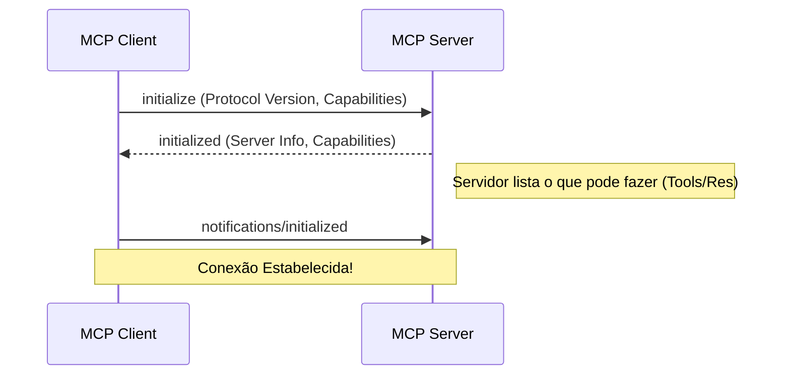

# Aula 03 - Arquitetura do MCP 🏗️

!!! tip "Objetivo"
    **Objetivo**: Compreender a estrutura interna do MCP, identificando os papéis do Cliente, Servidor e Modelo, e como eles interagem via diferentes métodos de transporte.

---

## 1. Os Três Pilares do MCP 🏛️

A arquitetura do MCP é baseada em três componentes fundamentais que trabalham em conjunto.

1.  **Modelo (The Intelligence)**: O LLM (como Claude 3.5, GPT-4). Ele decide *quando* usar uma ferramenta, mas não sabe *como* acessá-la diretamente.
2.  **Cliente (The Host)**: A aplicação que "hospeda" a IA (ex: Claude Desktop, Cursor, IDE). Ele gerencia as permissões e a conexão com os servidores.
3.  **Servidor (The Source)**: O programa que expõe dados e ferramentas (ex: um servidor que lê arquivos locais ou consulta o banco de dados).

---

## 2. Fluxo de Comunicação e Handshake 🤝

Antes de qualquer troca de dados, ocorre o **Handshake** (aperto de mão).



---

## 3. Métodos de Transporte 🚀

O MCP define como as mensagens JSON-RPC viajam entre o Cliente e o Servidor.

*   **Stdio (Standard Input/Output)**: O método mais comum. O Cliente inicia o Servidor como um processo filho e eles conversam via "terminal" (stdin/stdout). Muito seguro pois é local.
*   **HTTP with SSE (Server-Sent Events)**: Usado para conexões remotas. O Cliente faz requisições POST e recebe atualizações do servidor via SSE.

---

## 4. O Ciclo de Execução de uma Ferramenta (Tool) 🔄

1.  **Descoberta**: O Cliente pergunta ao Servidor: "Quais ferramentas você tem?".
2.  **Prompt**: O Modelo recebe a lista e diz: "Quero usar a ferramenta `X` com os argumentos `Y`".
3.  **Chamada**: O Cliente encaminha a solicitação ao Servidor.
4.  **Resposta**: O Servidor executa a lógica e envia o resultado de volta.
5.  **Contexto**: O Modelo usa o resultado para finalizar sua resposta ao usuário.

---

## 5. Prática: Visualizando Processos MCP 💻

Se você estiver usando o Claude Desktop, pode ver os servidores MCP rodando como processos independentes.

```termynal
$ ps aux | grep mcp
user  1234  0.1  0.5  node /path/to/mcp-server-postgres
user  1235  0.2  0.4  python /path/to/mcp-server-files
[INFO] Servidores rodando isolados do Cliente principal.
```

---

## 6. Mini-Projeto: Desenhando sua Arquitetura 🧪

Projete um sistema onde um **Assistente de RH** precisa acessar:
1.  Um banco de dados de funcionários (Servidor A).
2.  Um serviço de envio de e-mails (Servidor B).

*   Identifique quem é o Cliente.
*   Liste os Servidores necessários.
*   Descreva um fluxo onde a IA consulta um salário e envia um holerite.

---

## 7. Exercícios de Fixação 📝

1.  Qual o papel do **Cliente MCP** no gerenciamento de segurança?
2.  Por que o transporte **Stdio** é considerado muito seguro?
3.  O que acontece no passo de `initialize` durante o Handshake?

---

!!! concept "Atenção"
    O Servidor MCP nunca conversa diretamente com o Modelo (LLM). O Cliente funciona como um intermediário obrigatório para garantir segurança e controle.

**Próxima Aula**: [Estrutura de Recursos no MCP](./aula-04.md) 📂
