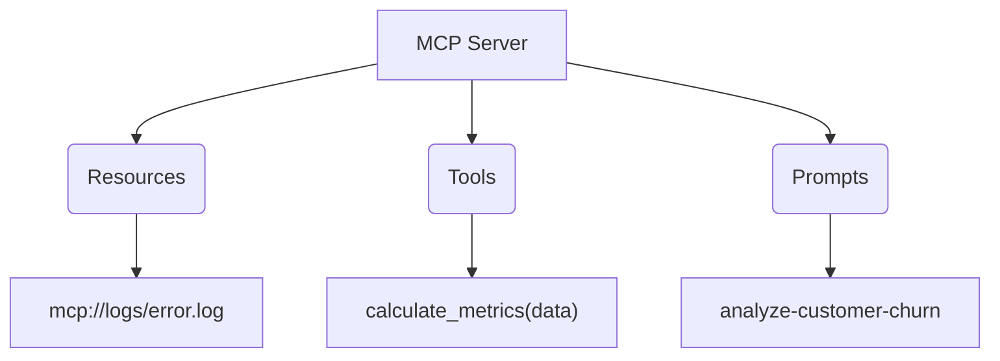

# Aula 04 - Estrutura de Recursos no MCP 📂

!!! tip "Objetivo"
    **Objetivo**: Dominar os três pilares funcionais do MCP: Resources, Tools e Prompts. Aprender como esses componentes expõem dados, ações e instruções para a IA.

---

## 1. Resources (Os Dados) 💾

**Resources** são dados que o servidor disponibiliza para leitura. Eles funcionam de forma similar a arquivos ou páginas web.

*   **Identificação**: Cada recurso tem uma **URI** única (ex: `postgres://database/table/schema`).
*   **Tipos**:
    *   **Estáticos**: Arquivos de configuração, logs antigos.
    *   **Dinâmicos**: O conteúdo muda conforme a consulta (ex: o saldo atual de uma conta).
*   **Exposição**: O servidor lista os recursos disponíveis e o cliente pode lê-los conforme necessário.

---

## 2. Tools (As Ações) 🛠️

**Tools** são funções executáveis que permitem que a IA interaja com o mundo exterior.

*   **Capacidade**: Diferente dos resources (que são apenas leitura), as Tools podem realizar ações (ex: criar um arquivo, enviar um tweet, deletar um registro).
*   **Definição**: Cada Tool define um nome, uma descrição clara (para a IA entender quando usar) e um esquema de argumentos (JSON Schema).

!!! concept "Importante"
    A descrição da Tool é o que guia a IA. Se a descrição for ruim, a IA não saberá quando chamá-la.

---

## 3. Prompts (As Instruções) 🧠

**Prompts** no MCP são templates de texto pré-configurados que ajudam a guiar o comportamento da IA para tarefas específicas.

*   **Reuso**: Permite criar padrões de resposta ou análise que podem ser usados por qualquer usuário do servidor.
*   **Dinâmismo**: Podem aceitar argumentos para preencher lacunas no texto (ex: um template de "Análise de Código" que recebe o nome do arquivo).

---

## 4. URI Schemes e Descoberta 🔍

O MCP utiliza o conceito de URIs para localizar e identificar capacidades.



---

## 5. Prática: Listando Capacidades 💻

Vamos usar o inspetor para ver o que um servidor MCP "conhece".

```termynal
$ mcp-inspect list-resources
[INFO] Recursos disponíveis:
- mcp://local/docs/manual.md (Markdown)
- mcp://db/users/active (JSON)

$ mcp-inspect list-prompts
[INFO] Prompts disponíveis:
- code-review: "Analise o código buscando bugs..."
- summarize-meetings: "Resuma a transcrição de..."
```

---

## 6. Mini-Projeto: Planejando seu Servidor 🧪

Pense em um servidor MCP para um **Gerenciador de Viagens**.

1.  Defina 1 **Resource** (ex: lista de destinos).
2.  Defina 1 **Tool** (ex: reservar_voo).
3.  Defina 1 **Prompt** (ex: sugestao_itinerario).

*Escreva as URIs e as descrições em um arquivo de texto.*

---

## 7. Exercícios de Fixação 📝

1.  Qual a principal diferença entre um **Resource** e uma **Tool**?
2.  Por que a descrição de uma Tool é considerada "Engenharia de Prompt"?
3.  Como as URIs ajudam na organização de um servidor MCP com muitos dados?

---

!!! info "Dica"
    Ao criar Tools, sempre use nomes descritivos como `search_financial_records` em vez de apenas `search`. Isso ajuda a IA a ser mais precisa.

**Próxima Aula**: [Comunicação Cliente ↔ Servidor MCP](./aula-05.md) 🔄