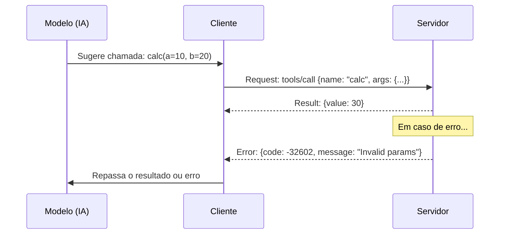

# Aula 05 - Comunicação Cliente ↔ Servidor MCP 🔄

!!! tip "Objetivo"
    **Objetivo**: Detalhar o ciclo de vida de uma conexão MCP, desde o handshake inicial até a execução de ferramentas e o tratamento de erros em tempo real.

---

## 1. O Ciclo de Vida da Conexão 🧬

Uma conexão MCP não é apenas um "abre e fecha" de canal. Ela possui estados bem definidos.

1.  **Lançamento (Spawn)**: O cliente inicia o processo do servidor (em Stdio) ou conecta-se à URL (em SSE).
2.  **Handshake (Inicialização)**: Troca de capacidades e versões.
3.  **Vida Útil (Runtime)**: Troca constante de requisições (`requests`) e notificações (`notifications`).
4.  **Finalização (Shutdown)**: Encerramento limpo da conexão.

---

## 2. Requisições vs Notificações 📩

No JSON-RPC do MCP, existem dois tipos principais de mensagens:

*   **Requests**: Exigem uma resposta (ex: "Me dê a lista de ferramentas"). Possuem um `id`.
*   **Notifications**: São informativas e não esperam resposta (ex: "O progresso da tarefa X mudou para 50%"). Não possuem `id`.

---

## 3. Chamada de Ferramentas e Tratamento de Erros 🛠️

Quando a IA decide usar uma ferramenta, o fluxo técnico é rigoroso:



### Códigos de Erro Comuns
*   `-32700`: Erro de Parse (JSON inválido).
*   `-32601`: Método não encontrado.
*   `-32602`: Argumentos inválidos.

---

## 4. Sampling (O Caminho Inverso) 🔄

Uma funcionalidade avançada do MCP é o **Sampling**. Ela permite que o Servidor peça ao Cliente para que o Modelo (LLM) complete um texto ou tome uma decisão.

!!! concept "Inversão de Papel"
    No Sampling, o Servidor "pede um favor" para a inteligência do Modelo através do Cliente.

---

## 5. Prática: Simulando um Erro de Schema 💻

Vamos forçar um erro de validação para ver como o MCP responde.

```termynal
$ mcp-inspect call weather --city 123
[SEND] --> {"method": "tools/call", "params": {"name": "weather", "arguments": {"city": 123}}}
[RECV] <-- {"error": {"code": -32602, "message": "Expected string, got number"}}
[ERROR] Falha na validação dos parâmetros!
```

---

## 6. Mini-Projeto: Debugging de Conexão 🧪

1.  Crie um log fictício de uma conversa JSON-RPC que falhou por `timeout`.
2.  Identifique se o erro aconteceu no cliente ou no servidor.
3.  Proponha uma solução (ex: aumentar o tempo de espera ou simplificar a query).

---

## 7. Exercícios de Fixação 📝

1.  Qual a diferença fundamental entre uma `request` e uma `notification`?
2.  Por que o `id` é obrigatório em uma requisição JSON-RPC?
3.  O que é o recurso de **Sampling** e por que ele é especial?

---

!!! info "Dica"
    Sempre registre logs detalhados (tracing) do tráfego JSON-RPC durante o desenvolvimento. Isso economiza horas de debugging.

**Próxima Aula**: [Implementação de um Servidor MCP (Backend)](./aula-06.md) ⚙️
