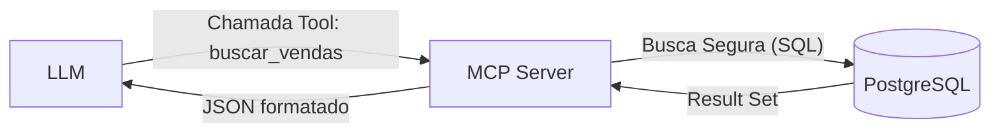

# Aula 07 - Integração do MCP com Banco de Dados 💾

!!! tip "Objetivo"
    **Objetivo**: Aprender a conectar servidores MCP a bancos de dados relacionais de forma segura, expondo esquemas, permitindo consultas filtradas e garantindo a integridade dos dados.

---

## 1. O Papel do MCP no Acesso a Dados 🗄️

Conectar uma IA a um banco de dados é um dos casos de uso mais poderosos do MCP. No entanto, **nunca** devemos dar acesso total e irrestrito.

*   **Resources**: Ideais para expor tabelas de referência ou relatórios estáticos.
*   **Tools**: Ideais para buscas parametrizadas, inserções e atualizações controladas.

---

## 2. Segurança: Evitando SQL Injection 🛡️

Quando uma IA gera uma query, existe o risco de manipulação maliciosa. A regra de ouro é: **Sempre use Prepared Statements**.

```typescript
// Exemplo RUIM (Vulnerável)
const query = `SELECT * FROM users WHERE id = ${args.id}`; 

// Exemplo BOM (Seguro)
const query = "SELECT * FROM users WHERE id = $1";
const result = await db.query(query, [args.id]);
```

---

## 3. Expondo o Esquema (Introspecção) 🔍

Para que a IA saiba como perguntar, ela precisa conhecer as colunas e tipos de dados.

!!! concept "Dica de Contexto"
    Sempre forneça comentários no seu esquema de banco de dados. "A coluna `status_id` reflete o estado do pedido" é muito mais útil para a IA do que apenas `status_id: int`.

### Diagrama de Fluxo (Mermaid)



---

## 4. Ferramentas de CRUD Controlado 🛠️

Em vez de uma tool `executar_sql_livre`, prefira ferramentas específicas:

*   `list_recent_orders(limit: number)`
*   `get_customer_by_email(email: string)`
*   `update_inventory_stock(product_id: string, amount: number)`

---

## 5. Prática: Consultando SQLite com MCP 💻

Vamos simular a implementação de uma ferramenta de busca em SQLite.

```python
@mcp.tool()
def consultar_estoque(produto: str) -> str:
    """Busca a quantidade em estoque de um produto específico."""
    # Simulação de query segura
    cursor.execute("SELECT qtd FROM estoque WHERE nome = ?", (produto,))
    row = cursor.fetchone()
    return f"Estoque de {produto}: {row[0] if row else 'Não encontrado'}"
```

---

## 6. Mini-Projeto: Dashboard MCP 🧪

1.  Escolha uma tabela (ex: Clientes).
2.  Crie um **Resource** que retorna a contagem total de clientes por cidade.
3.  Crie uma **Tool** que permite buscar um cliente pelo CPF.
4.  Implemente logs de auditoria simples ("Quem consultou o quê").

---

## 7. Exercícios de Fixação 📝

1.  Por que é perigoso deixar a IA escrever SQL livre no seu servidor MCP?
2.  Diferencie o uso de um Resource e uma Tool para exibição de dados de um banco.
3.  O que é parametrização de queries e por que ela é obrigatória?

---

!!! warning "Cuidado"
    A exposição de dados sensíveis (PII) via MCP deve seguir rigorosamente as leis de proteção de dados (LGPD). Nunca exponha senhas ou dados criptografados para o modelo de IA.

**Próxima Aula**: [Segurança no MCP](./aula-08.md) 🔐