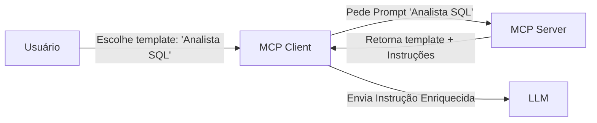

# Aula 09 - MCP e Engenharia de Prompt 🧠

!!! tip "Objetivo"
    **Objetivo**: Entender a intersecção entre o protocolo MCP e a Engenharia de Prompt, aprendendo a estruturar instruções que maximizam a eficiência da IA ao utilizar recursos e ferramentas externas.

---

## 1. O Papel do Contexto na IA 📚

Um LLM sem contexto é como um gênio preso em uma lâmpada. O MCP fornece os "olhos" e "mãos", mas a **Engenharia de Prompt** fornece a "estratégia".

*   **System Prompts**: Instruções de alto nível que definem como a IA deve usar o MCP (ex: "Sempre verifique o estoque antes de sugerir uma venda").
*   **Dynamic Injection**: Inserção de dados provenientes de Resources diretamente no prompt de sistema.

---

## 2. Injeção de Contexto Dinâmico 💉

Com o MCP, podemos injetar dados em tempo real no prompt, tornando a IA ciente do ambiente.

!!! concept "Fluxo de Injeção"
    1. Usuário pergunta: "Como está o servidor?"
    2. Prompt Template (do MCP Server) injeta: `[CONTEXTO: Logs atuais: {{mcp://server/logs}}]`
    3. IA recebe a pergunta já com os logs, sem precisar pedir.

---

## 3. Estruturação de Instruções para Tools 🛠️

A forma como descrevemos uma Tool no servidor MCP afeta drasticamente a performance:

| Componente | Exemplo Ruim | Exemplo Bom |
| :--- | :--- | :--- |
| **Nome** | `func1` | `get_user_financial_history` |
| **Descrição** | `Busca dados.` | `Recupera transações dos últimos 30 dias para análise de crédito.` |
| **Args** | `id: string` | `customer_uuid: string (Formato: xxxx-xxxx)` |

---

## 4. Templates de Prompts no MCP 📜

Como vimos na Aula 04, o MCP permite registrar templates de prompts.



---

## 5. Prática: Otimizando a Descrição de uma Tool 💻

Vamos transformar uma descrição técnica em uma descrição "AI-friendly".

```termynal
[OLD] nome: "search_db", desc: "procura no banco de dados"
[NEW] nome: "search_customer_by_tag", 
      desc: "Busca clientes baseando-se em interesses (tags) para campanhas de marketing."
[SUCCESS] A IA agora entende que deve usar esta ferramenta apenas para marketing!
```

---

## 6. Mini-Projeto: Prompt de Sistema Conectado 🧪

1.  Crie um **System Prompt** para um assistente de viagens.
2.  Defina como ele deve se comportar ao receber dados do Resource `mcp://viagens/destinos_populares`.
3.  Crie uma instrução que obrigue a IA a confirmar se o destino é seguro antes de sugerir para o usuário.

---

## 7. Exercícios de Fixação 📝

1.  Por que a descrição de uma Tool é considerada um "Prompt Oculto"?
2.  O que é **Injeção Dinâmica** e qual sua vantagem sobre o RAG tradicional?
3.  Como os **Prompt Templates** do MCP ajudam a padronizar o uso da IA em uma organização?

---

!!! info "Dica"
    Use o princípio da **Especificidade**. Quanto mais detalhes você der na descrição da tool, menos a IA "alucinará" parâmetros errados.

**Próxima Aula**: [MCP com Aplicações Web](./aula-10.md) 🌐
