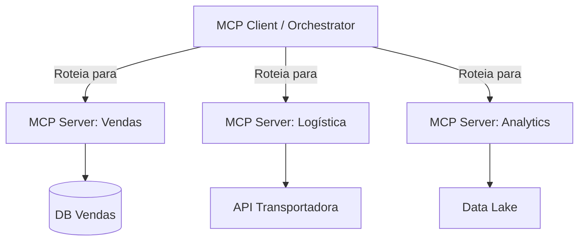

# Aula 11 - MCP e Arquitetura de Microsserviços 🔌

!!! tip "Objetivo"
    **Objetivo**: Entender como o MCP se encaixa em arquiteturas distribuídas complexas, permitindo a orquestração de múltiplos servidores MCP e garantindo a escalabilidade e observabilidade do sistema.

---

## 1. O MCP como Gateway de Inteligência ⛩️

Em uma arquitetura de microsserviços, o Cliente MCP pode atuar como um orquestrador que conecta a IA a dezenas de serviços independentes.

*   **Agregação**: Um único assistente de IA pode consumir Ferramentas e Recursos de diferentes servidores MCP simultaneamente.
*   **Desacoplamento**: Cada microsserviço pode ter seu próprio servidor MCP, facilitando a manutenção.

---

## 2. Orquestração e Roteamento 🗺️

Como o Cliente MCP sabe qual servidor chamar para cada pergunta?



---

## 3. Escalabilidade e Performance 📈

Rodar múltiplos servidores MCP exige cuidado com os recursos do sistema:

*   **Lazy Loading**: Inicie servidores MCP apenas quando necessário.
*   **Pool de Conexões**: Reutilize conexões HTTP/SSE para evitar latência.
*   **Cache**: Resultados de ferramentas que não mudam frequentemente (ex: preços de produtos) podem ser cacheados no Cliente.

---

## 4. Observabilidade e Tracing 🔎

Em microsserviços, é vital rastrear o caminho da requisição.

!!! concept "Tracing no MCP"
    Use **Correlation IDs** para vincular uma pergunta do usuário à execução de uma Tool em um servidor MCP específico. Isso ajuda a identificar qual serviço está lento ou falhando.

---

## 5. Prática: Monitorando múltiplos servidores 💻

Vamos simular o status de um cluster de servidores MCP.

```termynal
$ mcp-status --all
[SERVICE] sales-mcp: ONLINE (12 tools)
[SERVICE] inventory-mcp: ONLINE (8 tools, 2 resources)
[SERVICE] billing-mcp: OFFLINE (Error: Connection refused)
[WARNING] Billing tools are currently unavailable!
```

---

## 6. Mini-Projeto: Arquitetura em Larga Escala 🧪

Desenhe a arquitetura para um **Marketplace Global**:

1.  Um servidor MCP exclusivo para tradução.
2.  Um servidor MCP para cálculo de frete internacional.
3.  Um servidor MCP para detecção de fraudes.

*   Descreva como o assistente usaria esses três servidores para fechar uma compra.
*   Explique como você lidaria com a queda do servidor de tradução (Resiliência).

---

## 7. Exercícios de Fixação 📝

1.  Quais as vantagens de separar as funcionalidades de uma empresa em múltiplos servidores MCP em vez de um único servidor gigante?
2.  O que é **Lazy Loading** aplicado a servidores MCP e por que ele economiza memória?
3.  Como os logs centralizados ajudam a debugar erros em arquiteturas de microsserviços com MCP?

---

!!! info "Dica"
    Ao trabalhar com muitos servidores, utilize um **Registry de Servidores** para automatizar a descoberta e configuração das URLs e chaves de acesso.

**Próxima Aula**: [Tratamento de Estado e Contexto Persistente](./aula-12.md) 🔑