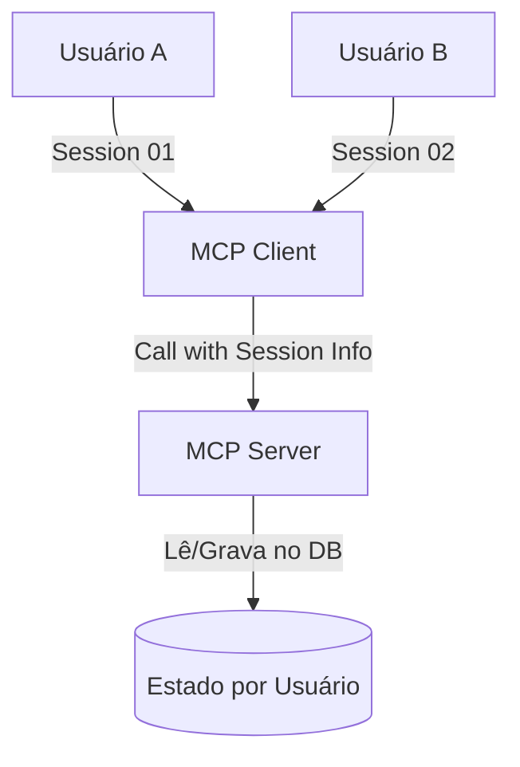

# Aula 12 - Tratamento de Estado e Contexto Persistente 🔑

!!! tip "Objetivo"
    **Objetivo**: Explorar como o MCP lida com a persistência de informações entre diferentes turnos de conversa e como gerenciar o estado da sessão para criar experiências de IA com "memória".

---

## 1. Memória Temporária vs Memória Persistente 🧠

A maioria das IAs trabalha com uma "janela de contexto". O MCP ajuda a estender essa janela através de diferentes estratégias.

*   **Estado Transiente (Volátil)**: Informações que duram apenas enquanto o servidor MCP está rodando (ex: a última Tool chamada).
*   **Estado Persistente**: Dados gravados em disco ou banco de dados que sobrevivem ao reinício do servidor (ex: as preferências de um usuário).

---

## 2. Sessões no MCP 🛡️

Cada conexão entre um Cliente e um Servidor pode ser tratada como uma **Sessão**.

!!! concept "Estado da Sessão"
    O servidor pode manter dados específicos para cada `session_id`. Isso é vital para que a IA não confunda as consultas do Usuário A com as do Usuário B.



---

## 3. Estratégias de Armazenamento de Contexto 💾

Como guardar o histórico do que a IA fez via MCP?

1.  **Server-Side Logs**: O servidor guarda o histórico de execuções.
2.  **Client-Side History**: O cliente (IDE/App) guarda a conversa e re-injeta o contexto nas próximas chamadas.
3.  **Memória Semântica**: Usar um banco de dados vetorial para buscar execuções passadas do MCP baseando-se na similaridade da pergunta atual.

---

## 4. O Problema do Inchaço do Contexto (Context Bloat) 🎈

Muitos dados de Resources podem estourar a memória da IA.

*   **Pruning (Poda)**: Remover partes irrelevantes dos dados antes de enviar para a IA.
*   **Summarization**: O servidor resume os logs longos antes de enviá-los via Resource.

---

## 5. Prática: Persistindo Preferências 💻

Vamos simular uma Tool que "lembra" do tom de voz preferido do usuário.

```typescript
// No servidor MCP
let userPreferences = new Map();

server.tool("save_preference", "Salva o tom de voz", { tone: z.string() }, 
  async ({ tone }, { sessionId }) => {
    userPreferences.set(sessionId, tone);
    return { content: [{ type: "text", text: "Preferência salva!" }] };
  }
);
```

---

## 6. Mini-Projeto: Gerenciador de Sessão 🧪

1.  Crie um fluxo onde o usuário define um "Projeto Ativo".
2.  Toda Tool chamada a partir daí deve incluir o `project_id` automaticamente.
3.  Implemente uma Tool `get_session_summary` que lista as últimas 3 ações realizadas nesta sessão.

---

## 7. Exercícios de Fixação 📝

1.  Qual a diferença entre um estado volátil e um estado persistente em um servidor MCP?
2.  Por que o `session_id` é importante em ambientes multi-usuário?
3.  O que é e por que fazer o "Resumo de Contexto" (Summarization) antes de enviar dados para a IA?

---

!!! info "Dica"
    Ao projetar ferramentas, tente torná-las **Idempotentes** (executar a mesma ação várias vezes tem o mesmo efeito). Isso evita erros caso a IA repita uma chamada por falha de memória.

**Próxima Aula**: [Testes e Validação](./aula-13.md) 🧪
