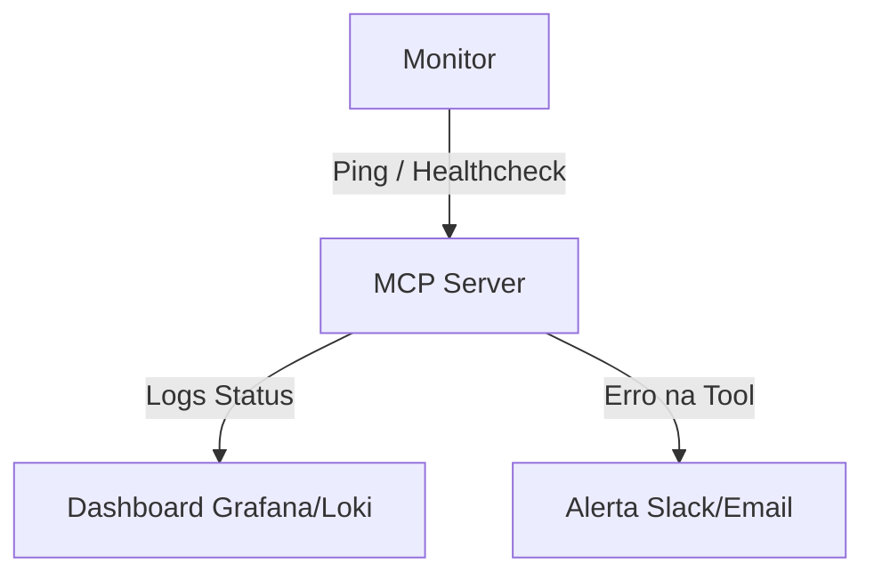

# Aula 13 - Testes e Validação 🧪

!!! tip "Objetivo"
    **Objetivo**: Aprender estratégias para testar servidores MCP, garantindo que as ferramentas e recursos funcionem conforme o esperado e que a integração com a IA seja robusta e livre de erros.

---

## 1. A Pirâmide de Testes para MCP 🏗️

Testar aplicações de IA exige uma abordagem em camadas:

1.  **Testes Unitários**: Valide a lógica interna das suas ferramentas (ex: a função de soma realmente soma?).
2.  **Testes de Integração**: Teste a conexão JSON-RPC entre um cliente simulado e o seu servidor.
3.  **Testes de Modelo (Evals)**: Verifique se o LLM entende quando e como chamar as suas ferramentas.

---

## 2. Mocking do Cliente e Transporte 🎭

Não precisamos do Claude Desktop para testar nosso servidor. Podemos usar ferramentas que simulam o cliente.

*   **mcp-inspector**: Permite chamadas manuais e visualização de logs.
*   **Scripts de Teste**: Pequenos programas que enviam JSON via `stdin` e leem o `stdout`.

```typescript
// Exemplo de teste unitário simples (Jest)
test("calculate_area tool should return correct area", async () => {
    const result = await calculateArea({ width: 10, height: 5 });
    expect(result.content[0].text).toBe("A área é 50");
});
```

---

## 3. Testando a Descrição da Tool (AI-Consistency) 🤖

Se a IA chama a ferramenta errada para uma pergunta, o problema costuma estar na descrição.

!!! concept "Teste de Gatilho (Trigger Test)"
    Tente fazer perguntas variadas para uma IA de teste e veja se ela escolhe a sua Tool corretamente.
    *   Pergunta: "Qual o tamanho da sala de 4x5?" -> Deve chamar `calculate_area`.
    *   Pergunta: "Quanto custa o metro?" -> NÃO deve chamar `calculate_area`.

---

## 4. Monitoramento em Produção 🔎

Após o deploy, precisamos saber se o servidor está saudável.

*   **Heartbeat**: O servidor responde a requisições de `ping`?
*   **Erro Rate**: Qual a porcentagem de chamadas de ferramentas que retornam erro de parâmetro?



---

## 5. Prática: Validando Respostas JSON 💻

Use ferramentas de validação de schema para garantir que seu servidor nunca envie um JSON malformado.

```termynal
$ npm run test:mcp
[RUN] Testando Handshake... PASS
[RUN] Testando Tool 'get_weather'... PASS
[RUN] Validando JSON Schema da resposta... PASS
[SUCCESS] 3/3 testes concluídos com sucesso!
```

---

## 6. Mini-Projeto: Suíte de Testes 🧪

1.  Crie um conjunto de 5 perguntas (prompts) que a IA *deveria* conseguir resolver usando as ferramentas do seu servidor.
2.  Teste cada uma no Inspetor e anote o resultado.
3.  Se a IA falhar em uma, ajuste a descrição da Tool e teste novamente até obter 100% de sucesso.

---

## 7. Exercícios de Fixação 📝

1.  Diferencie um teste unitário de um "Teste de Modelo" (Eval).
2.  Por que o `mcp-inspector` é essencial durante a fase de desenvolvimento?
3.  Como você monitoraria se um servidor MCP remoto está parando de responder?

---

!!! info "Dica"
    Automatize seus testes de Handshake em cada `git push` para evitar que mudanças no código quebrem a inicialização do servidor.

**Próxima Aula**: [Deploy de Servidor MCP](./aula-14.md) 🚢