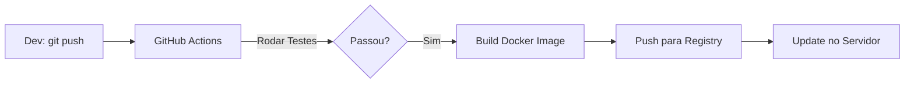

# Aula 14 - Deploy de Servidor MCP 🚢

!!! tip "Objetivo"
    **Objetivo**: Aprender a preparar um servidor MCP para produção, utilizando Docker para isolamento, gerenciando variáveis de ambiente e explorando opções de hospedagem na nuvem.

---

## 1. Dockerização: Portabilidade e Isolamento 🐳

O Docker é a ferramenta padrão para garantir que seu servidor MCP rode da mesma forma no seu computador e na nuvem.

### Exemplo de Dockerfile (Node.js)

```dockerfile
FROM node:20-slim
WORKDIR /app
COPY package*.json ./
RUN npm install --production
COPY . .
RUN npm run build
EXPOSE 3000
CMD ["node", "build/index.js"]
```

---

## 2. Gerenciando Segredos (Variáveis de Ambiente) 🔑

Nunca deixe chaves de API ou senhas de banco de dados no seu código-fonte. Use arquivos `.env` ou o gerenciador de segredos da sua nuvem.

*   `OPENAI_API_KEY`: Para servidores que fazem sampling.
*   `DATABASE_URL`: Para conexão com bancos de dados.
*   `LOG_LEVEL`: Para controlar o detalhamento dos logs.

---

## 3. Estratégias de Deploy 🚀

Dependendo do seu caso de uso, você pode escolher diferentes caminhos:

*   **Local (Claude Desktop)**: O deploy é apenas apontar o caminho do binário no arquivo `config.json`.
*   **Remote (Managed Services)**:
    *   **Render / Railway / Fly.io**: Excelentes para deploy rápido via HTTP/SSE.
    *   **AWS Lambda**: Ideal para ferramentas que são chamadas esporadicamente (Escalabilidade Automática).

---

## 4. CI/CD: Automatizando o Lançamento 🤖

Use GitHub Actions para automatizar o build e o teste do seu servidor MCP a cada commit.



---

## 5. Prática: Buildando sua Imagem 💻

Vamos simular o build de uma imagem Docker para o nosso servidor.

```termynal
$ docker build -t meu-servidor-mcp .
[INFO] Construindo imagem...
[SUCCESS] Imagem 'meu-servidor-mcp:latest' criada com sucesso!
[INFO] Testando localmente...
$ docker run -p 3000:3000 meu-servidor-mcp
```

---

## 6. Mini-Projeto: Configurações de Deploy 🧪

1.  Crie um arquivo `docker-compose.yml` que sobe o seu servidor MCP e um banco de dados PostgreSQL.
2.  Defina as variáveis de ambiente necessárias para a conexão.
3.  Simule um script de deploy que atualiza o servidor sem derrubar a conexão dos usuários (Zero Downtime).

---

## 7. Exercícios de Fixação 📝

1.  Por que o Docker é fundamental para servidores MCP que serão distribuídos para outros usuários?
2.  Como você gerenciaria segredos (como senhas) em um deploy no AWS Lambda?
3.  Qual a vantagem de usar **SSE (Server-Sent Events)** em vez de Stdio para um servidor que precisa ser acessado por vários clientes ao redor do mundo?

---

!!! info "Importante"
    Em deploy remoto, certifique-se de configurar um **Firewall** ou **API Gateway** para garantir que apenas Clientes autorizados consigam conversar com o seu servidor MCP.

**Próxima Aula**: [Projeto Prático Orientado](./aula-15.md) 🎓
