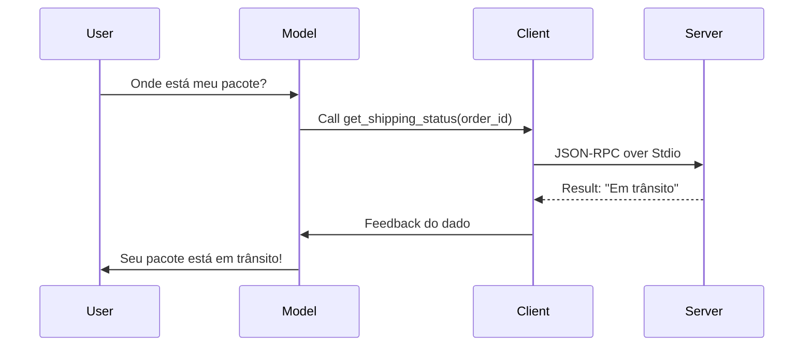

# Projeto 03 - Mapeamento de Arquitetura MCP 🏗️

## Objetivo
Desenhar e documentar a arquitetura técnica de uma integração MCP complexa, identificando os papéis do Cliente, Servidor e Modelo.

## Requisitos
- Ferramenta de diagramação (Mermaid Live Editor, LucidChart ou Excalidraw).

## Atividades
1. **Cenário**: Imagine uma IA de suporte para uma loja de e-commerce.
2. **Desenho do Fluxo**: Crie um diagrama de sequência Mermaid mostrando o usuário perguntando o status de um pedido e a IA chamando um servidor MCP de logística.
3. **Definição de Transport**: Justifique a escolha entre Stdio ou SSE para este cenário específico.

## Entrega
- Diagrama exportado (PNG ou link Mermaid).
- Texto explicativo sobre a infraestrutura necessária para rodar o cliente e o servidor.

---

