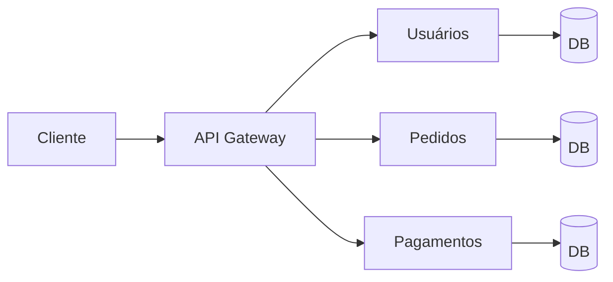

# Aula 01 - Introdução a Microsserviços 🌐
## De Monólitos a Sistemas Distribuídos

---

## Agenda de Hoje 📅

1. Panorama do Software Moderno { .fragment }
2. Monólitos vs Microsserviços { .fragment }
3. A Economia das APIs { .fragment }
4. Escalabilidade Vertical vs Horizontal { .fragment }
5. Cinto de Utilidades (Ferramentas) { .fragment }
6. Setup do Ambiente { .fragment }

---

## 1. O Mundo Cloud-Native ☁️

- Sistemas globais exigem disponibilidade **24/7**. { .fragment }
- Milhões de requisições por segundo. { .fragment }
- Deploy contínuo (várias vezes ao dia). { .fragment }

---

## 2. A Evolução da Arquitetura 🏛️➡️🏗️

---

## 2.1 O Monólito 🏛️

- Um único projeto, um único deploy. { .fragment }
- Tudo ou nada: erro em um lugar afeta tudo. { .fragment }
- Difícil de escalar partes específicas. { .fragment }
- **Ideal para**: Projetos pequenos, MVPs rápidos. { .fragment }

---

## 2.2 Microsserviços 🏗️

- Conjunto de serviços independentes. { .fragment }
- Comunicação via rede (APIs). { .fragment }
- Cada um com seu banco de dados. { .fragment }
- **Ideal para**: Sistemas complexos e escaláveis. { .fragment }

---

## 3. O Papel das APIs 📡

- **Contract-First**: Acordo de comunicação. { .fragment }
- REST como padrão dominante. { .fragment }
- JSON: A língua universal. { .fragment }

---

## Escalabilidade: Vertical vs Horizontal

| Vertical (Scale Up) | Horizontal (Scale Out) |
| :--- | :--- |
| Aumenta CPU/RAM | Adiciona mais servidores |
| Tem limite físico | Virtualmente ilimitada |
| Causa downtime no upgrade | Zero downtime (Redundância) |

---

## Arquitetura de Microsserviços

---

## 4. Ferramentas Indispensáveis 🛠️

---

## Client HTTP: Postman & Insomnia

- Testar rotas sem Frontend. { .fragment }
- Analisar Headers e Status Codes. { .fragment }
- Simular diferentes cenários de erro. { .fragment }

---

## Containerização: Docker 🐋

- "Roda na minha máquina, roda em qualquer lugar". { .fragment }
- Isola dependências e versões. { .fragment }
- Facilita a subida de múltiplos serviços locais. { .fragment }

---

## 5. Estrutura de Projeto Backend 📂

- Divisão clara de responsabilidades. { .fragment }
- Controllers, Services e Repositories. { .fragment }
- Tratamento global de exceções. { .fragment }

---

## 6. Setup do Ambiente 🚀

---

## Requisitos:

- IDE: VS Code ou IntelliJ. { .fragment }
- Postman (Desktop ou Extensão). { .fragment }
- Docker Desktop. { .fragment }
- Git & GitHub. { .fragment }

---

## Resumo da Aula ✅

- Microsserviços trazem resiliência e escala. { .fragment }
- APIs são o coração da comunicação moderna. { .fragment }
- Ferramentas como Docker mudaram o jogo. { .fragment }
- Começamos nossa jornada Fullstack! { .fragment }

---

## Próxima Aula: Arquitetura e Gateway 🏗️

- Como os serviços conversam? { .fragment }
- O que é Service Discovery? { .fragment }
- Protegendo a porta de entrada. { .fragment }

---

## Dúvidas? 🤔

> "A arquitetura de hoje é o legado de amanhã. Escolha com sabedoria."
