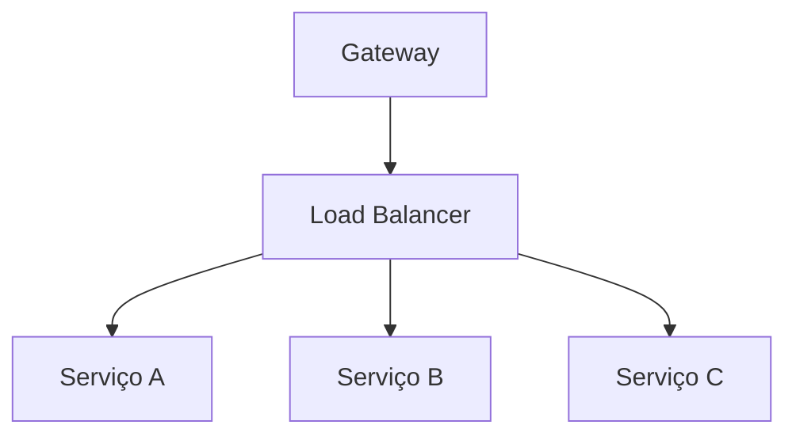

# Aula 02 - Arquitetura e Gateway 🏗️
## Orquestrando Microsserviços

---

## Agenda 📅

1. Comunicação entre Serviços { .fragment }
2. Síncrono vs Assíncrono { .fragment }
3. O Papel do API Gateway { .fragment }
4. Service Discovery { .fragment }
5. Load Balancing { .fragment }
6. Padrões de Resiliência { .fragment }

---

## 1. Como os Serviços Conversam? 💬

- Microsserviços são ilhas que precisam de pontes. { .fragment }
- Dois mundos: **Sync** e **Async**. { .fragment }

---

## 1.1 Comunicação Síncrona 🔄

- Cliente bloqueia até a resposta. { .fragment }
- Uso de HTTP/REST ou gRPC. { .fragment }
- **Risco**: Acoplamento temporal e gargalos. { .fragment }

---

## 1.2 Comunicação Assíncrona 📬

- Envia e esquece (Eventos). { .fragment }
- Uso de Filas e Tópicos (Broker). { .fragment }
- **Vantagem**: Escalabilidade e desacoplamento. { .fragment }

---

## 2. API Gateway: O Porteiro 🚪

- Única entrada para o mundo exterior. { .fragment }
- Esconde a complexidade interna. { .fragment }

---

## Gateway Responsibilities

- **Roteamento**: `/p` -> Pagamento, `/e` -> Estoque. { .fragment }
- **Segurança**: Autenticação centralizada. { .fragment }
- **Rate Limit**: Proteção contra flood. { .fragment }
- **Logs & Monitoramento**. { .fragment }

---

## 3. Service Discovery 🔎

- Onde está o servidor de pagamentos? { .fragment }
- Agenda dinâmica de IPs e Portas. { .fragment }
- **Ferramentas**: Netflix Eureka, Consul. { .fragment }

---

## 4. Load Balancing ⚖️

- Distribuição inteligente da carga. { .fragment }
- Evita que um container "morra" de trabalho. { .fragment }

---

## 5. Resiliência: Circuit Breaker 🔌

- Detecta serviços lentos ou falhos. { .fragment }
- Abre o circuito para proteger o resto do sistema. { .fragment }
- Evita o cascateamento de erros. { .fragment }

---

## Comparativo: Sync vs Async

| Característica | Síncrono 🔄 | Assíncrono 📬 |
| :--- | :--- | :--- |
| **Resposta** | Imediata | Eventual |
| **Desempenho** | Limitado pelo destino | Alto débito |
| **Uso comum** | Cadastro/Login | Geração de Relatórios |

---

## 6. Prática: O "Dashboard" Agregador 💻

- Como o Gateway une dados de 3 serviços? { .fragment }
- Agregação de respostas (Aggregation Pattern). { .fragment }

---

## Desafio Relâmpago ⚡

O que acontece se o seu API Gateway cair? Ele é um ponto único de falha?

---

## Resumo ✅

- Sync é fácil, Async é escalável. { .fragment }
- API Gateway protege e organiza. { .fragment }
- Service Discovery é essencial em containers. { .fragment }
- Resiliência não é opcional! { .fragment }

---

## Próxima Aula: Modelagem REST 📡

- Verbos HTTP. { .fragment }
- Status Codes. { .fragment }
- O contrato ideal. { .fragment }

---

## Dúvidas? 🏗️
