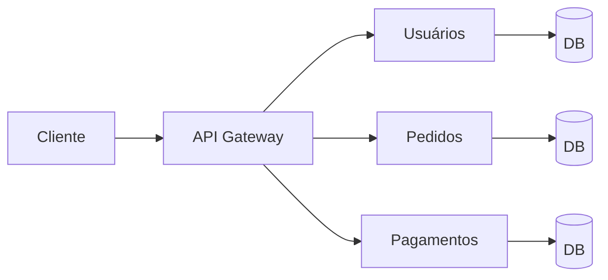

# Aula 01 - Introdução a Microsserviços 🌐
## De Monólitos a Sistemas Distribuídos

---

## Agenda de Hoje 📅

1. Panorama do Software Moderno <!-- .element: class="fragment" -->
2. Monólitos vs Microsserviços <!-- .element: class="fragment" -->
3. A Economia das APIs <!-- .element: class="fragment" -->
4. Escalabilidade Vertical vs Horizontal <!-- .element: class="fragment" -->
5. Cinto de Utilidades (Ferramentas) <!-- .element: class="fragment" -->
6. Setup do Ambiente <!-- .element: class="fragment" -->

---

## 1. O Mundo Cloud-Native ☁️

- Sistemas globais exigem disponibilidade **24/7**. <!-- .element: class="fragment" -->
- Milhões de requisições por segundo. <!-- .element: class="fragment" -->
- Deploy contínuo (várias vezes ao dia). <!-- .element: class="fragment" -->

---

## 2. A Evolução da Arquitetura 🏛️➡️🏗️

---

## 2.1 O Monólito 🏛️

- Um único projeto, um único deploy. <!-- .element: class="fragment" -->
- Tudo ou nada: erro em um lugar afeta tudo. <!-- .element: class="fragment" -->
- Difícil de escalar partes específicas. <!-- .element: class="fragment" -->
- **Ideal para**: Projetos pequenos, MVPs rápidos. <!-- .element: class="fragment" -->

---

## 2.2 Microsserviços 🏗️

- Conjunto de serviços independentes. <!-- .element: class="fragment" -->
- Comunicação via rede (APIs). <!-- .element: class="fragment" -->
- Cada um com seu banco de dados. <!-- .element: class="fragment" -->
- **Ideal para**: Sistemas complexos e escaláveis. <!-- .element: class="fragment" -->

---

## 3. O Papel das APIs 📡

- **Contract-First**: Acordo de comunicação. <!-- .element: class="fragment" -->
- REST como padrão dominante. <!-- .element: class="fragment" -->
- JSON: A língua universal. <!-- .element: class="fragment" -->

---

## Escalabilidade: Vertical vs Horizontal

| Vertical (Scale Up) | Horizontal (Scale Out) |
| :--- | :--- |
| Aumenta CPU/RAM | Adiciona mais servidores |
| Tem limite físico | Virtualmente ilimitada |
| Causa downtime no upgrade | Zero downtime (Redundância) |

---

## Arquitetura de Microsserviços

---

## 4. Ferramentas Indispensáveis 🛠️

---

## Client HTTP: Postman & Insomnia

- Testar rotas sem Frontend. <!-- .element: class="fragment" -->
- Analisar Headers e Status Codes. <!-- .element: class="fragment" -->
- Simular diferentes cenários de erro. <!-- .element: class="fragment" -->

---

## Containerização: Docker 🐋

- "Roda na minha máquina, roda em qualquer lugar". <!-- .element: class="fragment" -->
- Isola dependências e versões. <!-- .element: class="fragment" -->
- Facilita a subida de múltiplos serviços locais. <!-- .element: class="fragment" -->

---

## 5. Estrutura de Projeto Backend 📂

- Divisão clara de responsabilidades. <!-- .element: class="fragment" -->
- Controllers, Services e Repositories. <!-- .element: class="fragment" -->
- Tratamento global de exceções. <!-- .element: class="fragment" -->

---

## 6. Setup do Ambiente 🚀

---

## Requisitos:

- IDE: VS Code ou IntelliJ. <!-- .element: class="fragment" -->
- Postman (Desktop ou Extensão). <!-- .element: class="fragment" -->
- Docker Desktop. <!-- .element: class="fragment" -->
- Git & GitHub. <!-- .element: class="fragment" -->

---

## Resumo da Aula ✅

- Microsserviços trazem resiliência e escala. <!-- .element: class="fragment" -->
- APIs são o coração da comunicação moderna. <!-- .element: class="fragment" -->
- Ferramentas como Docker mudaram o jogo. <!-- .element: class="fragment" -->
- Começamos nossa jornada Fullstack! <!-- .element: class="fragment" -->

---

## Próxima Aula: Arquitetura e Gateway 🏗️

- Como os serviços conversam? <!-- .element: class="fragment" -->
- O que é Service Discovery? <!-- .element: class="fragment" -->
- Protegendo a porta de entrada. <!-- .element: class="fragment" -->

---

## Dúvidas? 🤔

> "A arquitetura de hoje é o legado de amanhã. Escolha com sabedoria."
