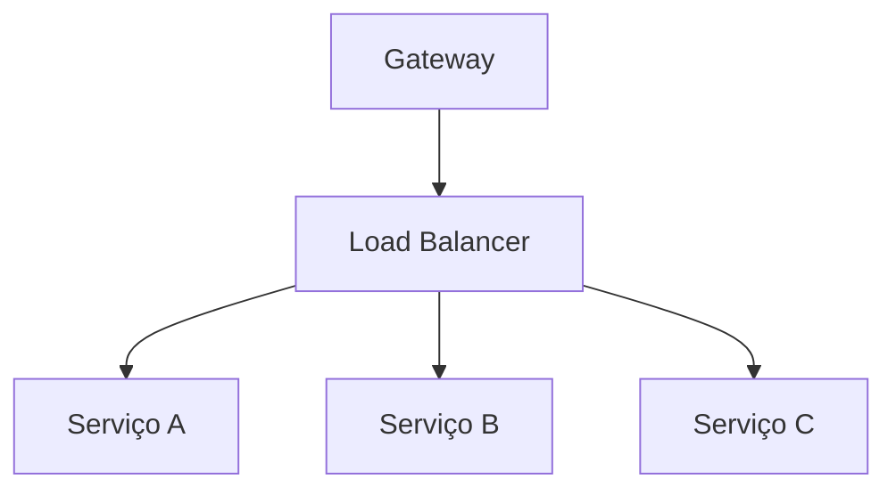

# Aula 02 - Arquitetura e Gateway 🏗️
## Orquestrando Microsserviços

---

## Agenda 📅

1. Comunicação entre Serviços <!-- .element: class="fragment" -->
2. Síncrono vs Assíncrono <!-- .element: class="fragment" -->
3. O Papel do API Gateway <!-- .element: class="fragment" -->
4. Service Discovery <!-- .element: class="fragment" -->
5. Load Balancing <!-- .element: class="fragment" -->
6. Padrões de Resiliência <!-- .element: class="fragment" -->

---

## 1. Como os Serviços Conversam? 💬

- Microsserviços são ilhas que precisam de pontes. <!-- .element: class="fragment" -->
- Dois mundos: **Sync** e **Async**. <!-- .element: class="fragment" -->

---

## 1.1 Comunicação Síncrona 🔄

- Cliente bloqueia até a resposta. <!-- .element: class="fragment" -->
- Uso de HTTP/REST ou gRPC. <!-- .element: class="fragment" -->
- **Risco**: Acoplamento temporal e gargalos. <!-- .element: class="fragment" -->

---

## 1.2 Comunicação Assíncrona 📬

- Envia e esquece (Eventos). <!-- .element: class="fragment" -->
- Uso de Filas e Tópicos (Broker). <!-- .element: class="fragment" -->
- **Vantagem**: Escalabilidade e desacoplamento. <!-- .element: class="fragment" -->

---

## 2. API Gateway: O Porteiro 🚪

- Única entrada para o mundo exterior. <!-- .element: class="fragment" -->
- Esconde a complexidade interna. <!-- .element: class="fragment" -->

---

## Gateway Responsibilities

- **Roteamento**: `/p` -> Pagamento, `/e` -> Estoque. <!-- .element: class="fragment" -->
- **Segurança**: Autenticação centralizada. <!-- .element: class="fragment" -->
- **Rate Limit**: Proteção contra flood. <!-- .element: class="fragment" -->
- **Logs & Monitoramento**. <!-- .element: class="fragment" -->

---

## 3. Service Discovery 🔎

- Onde está o servidor de pagamentos? <!-- .element: class="fragment" -->
- Agenda dinâmica de IPs e Portas. <!-- .element: class="fragment" -->
- **Ferramentas**: Netflix Eureka, Consul. <!-- .element: class="fragment" -->

---

## 4. Load Balancing ⚖️

- Distribuição inteligente da carga. <!-- .element: class="fragment" -->
- Evita que um container "morra" de trabalho. <!-- .element: class="fragment" -->

---

## 5. Resiliência: Circuit Breaker 🔌

- Detecta serviços lentos ou falhos. <!-- .element: class="fragment" -->
- Abre o circuito para proteger o resto do sistema. <!-- .element: class="fragment" -->
- Evita o cascateamento de erros. <!-- .element: class="fragment" -->

---

## Comparativo: Sync vs Async

| Característica | Síncrono 🔄 | Assíncrono 📬 |
| :--- | :--- | :--- |
| **Resposta** | Imediata | Eventual |
| **Desempenho** | Limitado pelo destino | Alto débito |
| **Uso comum** | Cadastro/Login | Geração de Relatórios |

---

## 6. Prática: O "Dashboard" Agregador 💻

- Como o Gateway une dados de 3 serviços? <!-- .element: class="fragment" -->
- Agregação de respostas (Aggregation Pattern). <!-- .element: class="fragment" -->

---

## Desafio Relâmpago ⚡

O que acontece se o seu API Gateway cair? Ele é um ponto único de falha?

---

## Resumo ✅

- Sync é fácil, Async é escalável. <!-- .element: class="fragment" -->
- API Gateway protege e organiza. <!-- .element: class="fragment" -->
- Service Discovery é essencial em containers. <!-- .element: class="fragment" -->
- Resiliência não é opcional! <!-- .element: class="fragment" -->

---

## Próxima Aula: Modelagem REST 📡

- Verbos HTTP. <!-- .element: class="fragment" -->
- Status Codes. <!-- .element: class="fragment" -->
- O contrato ideal. <!-- .element: class="fragment" -->

---

## Dúvidas? 🏗️
