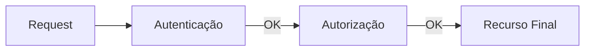

# Aula 10 - Controle de Acesso (RBAC) 🛡️
## Hierarquia e Segurança em Camadas

---

## Agenda 📅

1. O que é RBAC? (Roles) <!-- .element: class="fragment" -->
2. Autenticação vs Autorização <!-- .element: class="fragment" -->
3. O Fluxo do Middleware <!-- .element: class="fragment" -->
4. Erros 401 vs 403 <!-- .element: class="fragment" -->
5. Protegendo rotas na prática <!-- .element: class="fragment" -->
6. Hierarquia de Perfis <!-- .element: class="fragment" -->

---

## 1. Role-Based Access Control 👑

- Permissões ligadas a **Perfis** (Roles). <!-- .element: class="fragment" -->
- Ex: ADMIN, EDITOR, VIEWER. <!-- .element: class="fragment" -->
- Facilita a gestão de milhares de usuários. <!-- .element: class="fragment" -->

---

## 2. A Cancela (Middleware) 🚧

- O middleware checa se o usuário tem a "chave" certa. <!-- .element: class="fragment" -->
- Se não tiver -> 403 Forbidden. <!-- .element: class="fragment" -->
- Se tiver -> `next()`. <!-- .element: class="fragment" -->

---

## 3. O Fluxo de Segurança 🌊



---

## 4. 401 vs 403: Não confunda! ❌

- **401 (Unauthorized)**: "Quem é você?". Token inválido ou ausente. <!-- .element: class="fragment" -->
- **403 (Forbidden)**: "Eu sei quem você é, mas não deixo entrar". Falta de permissão. <!-- .element: class="fragment" -->

---

## 5. Implementação Dinâmica 🔒

```javascript
// Middleware genérico
router.delete('/usuario/:id', 
    autenticar, 
    autorizar(['ADMIN']), 
    userController.remover
);
```

---

## 6. Hierarquia de Acesso 🏛️

- Um Admin deve poder acessar rotas de User? <!-- .element: class="fragment" -->
- Design de sistema: Roles "Pai" e "Filho". <!-- .element: class="fragment" -->

---

## 7. Melhores Práticas 🏆

- Centralize a lógica em Middlewares. <!-- .element: class="fragment" -->
- Nunca exponha permissões sensíveis no frontend (segurança do lado do servidor). <!-- .element: class="fragment" -->

---

## Desafio: Segurança ⚡

Em um sistema escolar, o Diretor e o Professor podem ver notas. O Aluno só vê as dele. Como você configuraria a Role da rota `GET /notas`?

---

## Resumo ✅

- RBAC organiza permissões por grupos. <!-- .element: class="fragment" -->
- Middlewares são os guardiões das rotas. <!-- .element: class="fragment" -->
- Diferenciar 401 de 403 é vital para Debug. <!-- .element: class="fragment" -->

---

## Próxima Aula: Segurança Avançada 🏗️

### Session vs Token e Refresh Tokens

- O que fazer quando o token expira? <!-- .element: class="fragment" -->
- Protegendo contra ataques comuns (XSS, CSRF). <!-- .element: class="fragment" -->

---

## Dúvidas? 🛡️