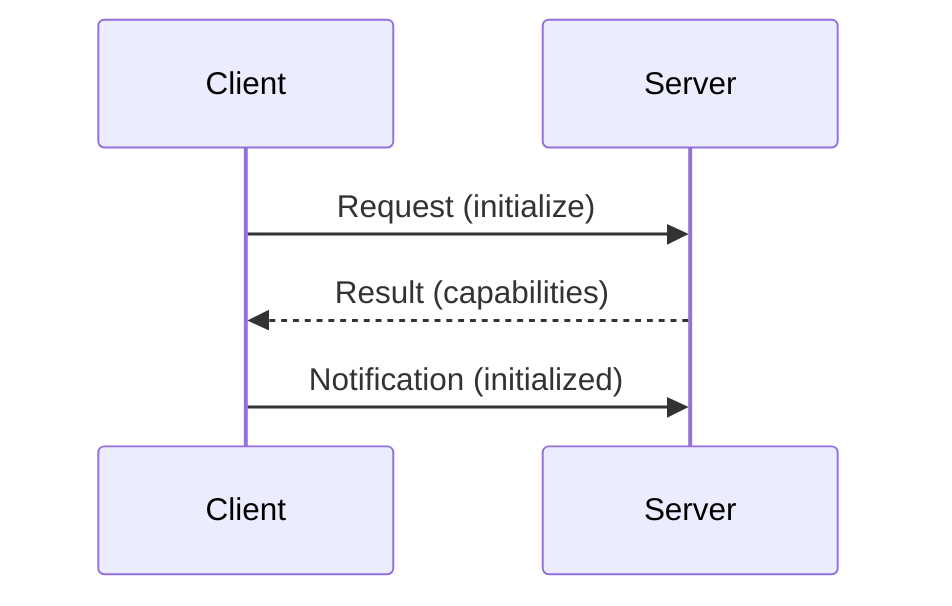

# Aula 02 - Fundamentos de Protocolos e APIs 📡
## As Bases Técnicas do MCP

---

## Agenda de Hoje 📅

1. O que é um Protocolo? { .fragment }
2. REST vs RPC { .fragment }
3. JSON-RPC 2.0: O Coração do MCP { .fragment }
4. Formatos de Dados (JSON) { .fragment }
5. Autenticação e Autorização { .fragment }
6. Contratos de Interface { .fragment }

---

## 1. O que é um Protocolo? 🔌

- Um conjunto de regras para comunicação. { .fragment }
- Garante que sistemas diferentes se entendam. { .fragment }
- Exemplo: HTTP (Web), SMTP (E-mail). { .fragment }

---

## 2. Modelos de Comunicação 🔄

---

## 2.1 REST (Representational State Transfer) 🏛️

- Focado em **recursos** (URLs). { .fragment }
- Verbos HTTP: GET, POST, PUT, DELETE. { .fragment }
- Ótimo para a web tradicional. { .fragment }

---

## 2.2 RPC (Remote Procedure Call) 🏗️

- Focado em **chamadas de função**. { .fragment }
- "Execute isto para mim". { .fragment }
- **MCP utiliza JSON-RPC**. { .fragment }

---

## 3. JSON-RPC 2.0 em Detalhes 📄

```json
{
  "jsonrpc": "2.0",
  "method": "tools/call",
  "params": {
    "name": "get_weather",
    "arguments": {"city": "SP"}
  },
  "id": 1
}
```

---

## 3.1 Anatomia da Mensagem

- **method**: A ação desejada. { .fragment }
- **params**: Os dados de entrada. { .fragment }
- **id**: Identificador da requisição. { .fragment }

---

## 4. Por que JSON? 💎

- Leve e legível por humanos. { .fragment }
- Independente de linguagem. { .fragment }
- Suporte nativo em quase todos os sistemas. { .fragment }

---

## 5. Contrato de Interface 📜

- "Se eu te enviar X, você me responde Y". { .fragment }
- Impede erros de processamento. { .fragment }
- Facilita a escalabilidade. { .fragment }

---

## 6. Fluxo de Handshake



---

## 7. Autenticação e Autorização 🔐

- **Autenticação**: "Quem é você?". { .fragment }
- **Autorização**: "O que você pode fazer?". { .fragment }
- Essencial para proteger dados sensíveis. { .fragment }

---

## 8. WebSockets e SSE 🌊

- **SSE**: Servidor envia dados em fluxo (MCP remoto). { .fragment }
- **WebSockets**: Bi-direcional em tempo real. { .fragment }

---

## 9. Prática: Mensagem Manual 💻

```termynal
$ echo '{"jsonrpc":"2.0","method":"resources/list"}' | mcp-server
[RECV] --> {"result": {"resources": [...]}}
```

---

## 10. Tratamento de Erros no Protocolo

- Códigos de erro padrão (ex: -32601). { .fragment }
- Mensagens claras para depuração. { .fragment }

---

## 11. O Papel do Schema 🏗️

- Define a estrutura obrigatória. { .fragment }
- Protege contra dados malformados. { .fragment }

---

## 12. Comparativo Tecnológico

| REST | RPC |
| :--- | :--- |
| Resource-based | Action-based |
| Verbos HTTP | JSON-RPC Methods |
| Web Browsers | Machine-to-Machine |

---

## 13. Resumo ✅

- Protocolos são os idiomas dos sistemas. { .fragment }
- JSON-RPC é eficiente para chamadas de IA. { .fragment }
- Contratos de interface garantem a estabilidade. { .fragment }

---

## 14. Mini-Projeto: Modelagem JSON

- Criar o JSON de uma ferramenta de "Consulta de CEP". { .fragment }

---

## 15. Dúvidas? 🤔

> "Um código sem contrato é um bug esperando para acontecer."
