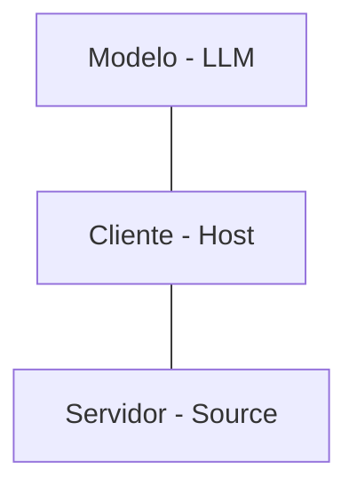
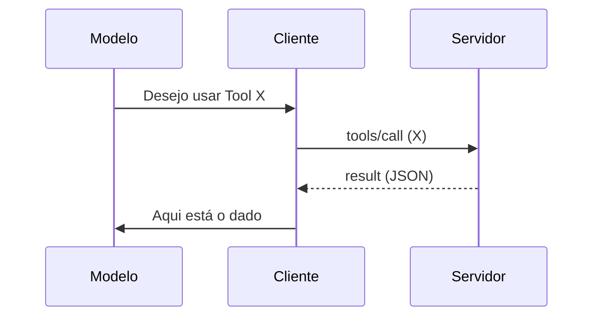

# Aula 03 - Arquitetura do MCP 🏗️
## Entendendo os Componentes e Fluxos

---

## Agenda de Hoje 📅

1. Cliente, Servidor e Modelo { .fragment }
2. Métodos de Transporte (Stdio vs SSE) { .fragment }
3. O Fluxo de Inicialização { .fragment }
4. Cicatrizando a Comunicação { .fragment }
5. Segurança por Design { .fragment }

---

## 1. Os Três Atores Principais 🎭



---

## 1.1 O Modelo (A Inteligência) 🧠

- Tome as decisões. { .fragment }
- Analisa os dados recebidos. { .fragment }
- Decide qual ferramenta chamar. { .fragment }

---

## 1.2 O Cliente (O Orquestrador) 👷

- Conecta o modelo aos servidores. { .fragment }
- Gerencia o estado e as permissões. { .fragment }
- Ex: Claude Desktop, Cursor, IDEs. { .fragment }

---

## 1.3 O Servidor (A Fonte) 💾

- Expor dados e funcionalidades. { .fragment }
- Conecta ao mundo real (Arquivos, APIs, DB). { .fragment }
- Rodam como processos isolados. { .fragment }

---

## 2. Métodos de Transporte 🚀

---

## 2.1 Stdio (Standard I/O) 📂

- Comunicação local via terminais. { .fragment }
- Muito seguro (isolado na máquina). { .fragment }
- Baixa latência. { .fragment }

---

## 2.2 SSE (HTTP + Server-Sent Events) ☁️

- Ideal para conexões remotas. { .fragment }
- Escalonável na nuvem. { .fragment }
- Exige tratamento de rede. { .fragment }

---

## 3. Ciclo de Vida do Servidor 🔄

- Launch -> Initialize -> Run -> Shutdown. { .fragment }

---

## 4. O Passo a Passo da Chamada

1. Modelo solicita `tool(args)`. { .fragment }
2. Cliente valida e envia `Request`. { .fragment }
3. Servidor executa e retorna `Result`. { .fragment }
4. Cliente entrega `Result` para o Modelo. { .fragment }

---

## 5. Diagrama de Sequência



---

## 6. Isolamento e Segurança 🔐

- Servidores rodam como subprocessos. { .fragment }
- Não afetam a estabilidade do Cliente. { .fragment }
- Permissões granulares por ferramenta. { .fragment }

---

## 7. Prática: Monitorando Processos

```termynal
$ ps -ef | grep mcp-server
root 1234 ... /usr/bin/node my-mcp-server.js
[INFO] Servidor rodando isolado.
```

---

## 8. Descoberta Dinâmica (Capabilities) 🔍

- O servidor diz ao cliente o que ele "sabe" fazer. { .fragment }
- Permite extensibilidade sem mudar o código do cliente. { .fragment }

---

## 9. Tratamento de Notificações 📩

- Mudança de estado sem interrupção. { .fragment }
- Logs de depuração em tempo real. { .fragment }

---

## 10. Resumo ✅

- Arquitetura desacoplada em 3 pilares. { .fragment }
- Stdio para local, SSE para remoto. { .fragment }
- Segurança centrada no Cliente. { .fragment }

---

## 11. Mini-Projeto: Fluxograma

- Desenhar o fluxo de uma consulta ao banco via MCP. { .fragment }

---

## 12. Dúvidas? 🤔

> "A arquitetura correta simplifica o impossível."