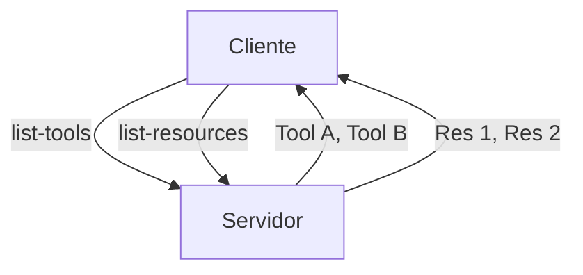
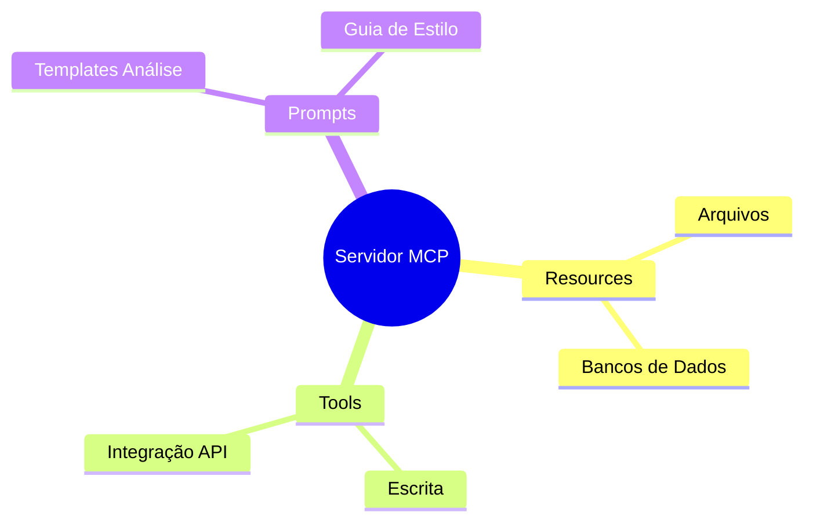

# Aula 04 - Estrutura de Recursos no MCP 📂
## Resources, Tools e Prompts

---

## Agenda de Hoje 📅

1. O que são Resources? { .fragment }
2. O Poder das Tools { .fragment }
3. Prompts: Templates de Inteligência { .fragment }
4. URIs e Esquemas de Localização { .fragment }
5. Discovery de Capacidades { .fragment }

---

## 1. Resources (Os Dados) 💾

- Dados para **leitura**. { .fragment }
- Podem ser estáticos ou dinâmicos. { .fragment }
- Exemplos: Logs, bases de conhecimento, registros. { .fragment }

---

## 1.1 Tipos de Recursos

- **Textos**: Markdown, JSON, TXT. { .fragment }
- **Binários**: Imagens, PDFs. { .fragment }

---

## 2. Tools (As Ações) 🛠️

- Funções que a IA pode **executar**. { .fragment }
- Causam mudanças no sistema ou buscam dados complexos. { .fragment }
- Ex: Enviar e-mail, salvar arquivo, deletar registro. { .fragment }

---

## 2.1 Tool Anatomy

- **Nome**: Identificador único. { .fragment }
- **Descrição**: Guia para o LLM. { .fragment }
- **Input Schema**: Validação de parâmetros. { .fragment }

---

## 3. Prompts (Instruções Reutilizáveis) 🧠

- Templates de texto para guiar o modelo. { .fragment }
- Padronizam tarefas complexas. { .fragment }
- Ex: "Analisar este código buscando bugs". { .fragment }

---

## 4. O Sistema de URIs 📍

- Cada recurso tem um endereço único. { .fragment }
- `mcp://my-server/database/users` { .fragment }

---

## 5. Discovery (A Descoberta) 🔍



---

## 6. Definindo Tools com JSON Schema

```json
{
  "type": "object",
  "properties": {
    "amount": { "type": "number" },
    "currency": { "type": "string" }
  }
}
```

---

## 7. Recursos Dinâmicos vs Estáticos

| Estático | Dinâmico |
| :--- | :--- |
| mcp://server/manual.md | mcp://server/status/cpu |
| Conteúdo fixo | Atualizado a cada leitura |

---

## 8. Prática: Inspecionando Capacidades 💻

```termynal
$ mcp-inspect list-resources
- mcp://local/logs/error.log
- mcp://local/docs/api-guide.md
```

---

## 9. O Papel das Descrições (Engenharia de Prompt)

- "Use esta ferramenta para..." { .fragment }
- Quanto melhor a descrição, menos a IA erra. { .fragment }

---

## 10. Organização de Capacidades



---

## 11. Resumo ✅

- Resources = Leitura de dados via URIs. { .fragment }
- Tools = Ações e funções parametrizadas. { .fragment }
- Prompts = Templates de instruções para o modelo. { .fragment }

---

## 12. Mini-Projeto: Planejamento

- Listar 1 Resource, 1 Tool e 1 Prompt para seu projeto. { .fragment }

---

## 13. Dúvidas? 🤔

> "Resources informam, Tools agem, Prompts guiam."
