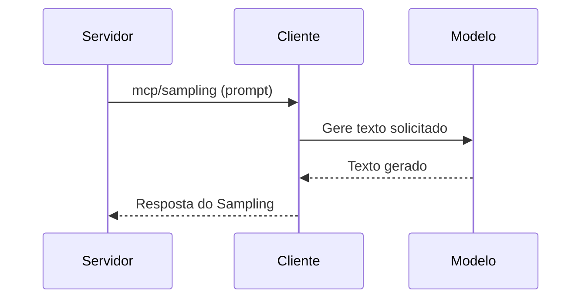
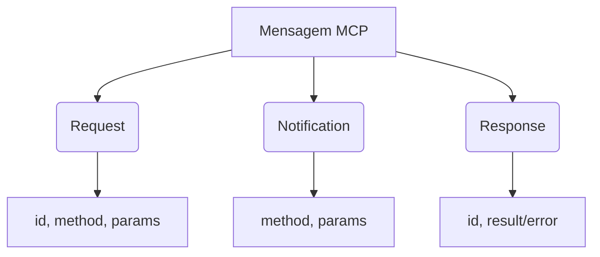

# Aula 05 - Comunicação Cliente ↔ Servidor 🔄
## Turnos, Mensagens e Fluxo de Dados

---

## Agenda de Hoje 📅

1. Requisições vs Notificações { .fragment }
2. O Papel do ID na Comunicação { .fragment }
3. Tratamento de Erros e Timeouts { .fragment }
4. SSE (Server-Sent Events) na Prática { .fragment }
5. Sampling: O Caminho Inverso { .fragment }

---

## 1. Requisições (Requests) 📩

- Exigem uma resposta (Response). { .fragment }
- Possuem um identificador único (`id`). { .fragment }
- Blocos de construção das Tools. { .fragment }

---

## 2. Notificações (Notifications) 📣

- "Fire and forget" (Dispare e esqueça). { .fragment }
- Não possuem `id`. { .fragment }
- Usadas para logs, progresso ou avisos. { .fragment }

---

## 3. O Identificador de Requisição (ID)

```json
{
  "jsonrpc": "2.0",
  "method": "foo",
  "id": "abc-123"
}
```

- Essencial para conversas assíncronas. { .fragment }
- Vincula a resposta à pergunta original. { .fragment }

---

## 4. O Fluxo de Samplig 🔄

- O Servidor pede algo para o Cliente (IA). { .fragment }
- "Gere um resumo deste artigo". { .fragment }
- Inversão de papéis no MCP. { .fragment }

---

## 5. Diagrama de Sampling



---

## 6. Tratamento de Erros Técnicos ⚠️

- `-32700`: Parse Error. { .fragment }
- `-32601`: Method not found. { .fragment }
- `-32602`: Invalid params. { .fragment }

---

## 7. Timeouts e Resiliência 🛡️

- O Cliente não espera para sempre. { .fragment }
- Definição de limites de tempo saudáveis. { .fragment }
- Tratamento de conexões interrompidas. { .fragment }

---

## 8. SSE: Server-Sent Events 🌊

- Unidirecional (Servidor -> Cliente). { .fragment }
- Perfeito para streaming de respostas e logs. { .fragment }
- Menos complexo que WebSockets para IA. { .fragment }

---

## 9. Prática: Inspecionando Requisições

```termynal
$ mcp-inspect call my_tool --debug
[SEND] --> {"id": 1, "method": "tools/call", ...}
[RECV] <-- {"id": 1, "result": {...}}
[SUCCESS] Ciclo completo!
```

---

## 10. Organização de Mensagens



---

## 11. O Papel do Stdio 📂

- Pipes de comunicação. { .fragment }
- `stdin` para o servidor receber. { .fragment }
- `stdout` para o servidor responder. { .fragment }

---

## 12. Resumo ✅

- Requests exigem IDs e Respostas. { .fragment }
- Notifications são apenas informativas. { .fragment }
- Sampling permite que o servidor use a IA. { .fragment }

---

## 13. Mini-Projeto: Log de Handshake

- Simular a sequência de initialize no papel. { .fragment }

---

## 14. Dúvidas? 🤔

> "A clareza na comunicação evita o caos na implementação."
