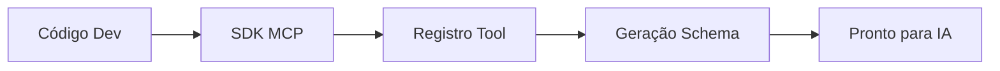

# Aula 06 - Implementação de um Servidor MCP ⚙️
## Do Setup ao "Olá Mundo"

---

## Agenda de Hoje 📅

1. Escolha da Stack (Node vs Python) { .fragment }
2. SDKs Oficiais { .fragment }
3. Estrutura de um Projeto MCP { .fragment }
4. Criando sua Primeira Tool { .fragment }
5. Depuração com o Inspector { .fragment }

---

## 1. Node.js vs Python 🥊

- **Node.js**: Ótimo para integrações de rede e APIs web. { .fragment }
- **Python**: Melhor para ciência de dados e IA nativa. { .fragment }
- O protocolo MCP é idêntico em ambos! { .fragment }

---

## 2. Setup com Node.js (TypeScript) 📂

```bash
npm init -y
npm install @modelcontextprotocol/sdk zod
```

---

## 3. Registrando uma Tool (Exemplo) 🛠️

```typescript
server.tool(
  "ola", 
  "Retorna uma saudação",
  { nome: z.string() },
  async ({ nome }) => {
    return { 
      content: [{ type: "text", text: `Olá, ${nome}!` }] 
    };
  }
);
```

---

## 4. O Poder do Zod (TypeScript) 🛡️

- Validação em tempo de execução. { .fragment }
- Garante que a IA envie os dados corretos. { .fragment }
- Gera o JSON Schema automaticamente. { .fragment }

---

## 5. Setup com Python (FastMCP) 🐍

```bash
pip install mcp fastmcp
```

```python
from fastmcp import FastMCP
mcp = FastMCP("Meu App")

@mcp.tool()
def somar(a: int, b: int) -> int:
    return a + b
```

---

## 6. Depuração: O MCP Inspector 🔍

- Ferramenta visual para testar o servidor. { .fragment }
- Não precisa de um LLM real para rodar. { .fragment }
- Permite ver erros de sintaxe rapidamente. { .fragment }

---

## 7. Rodando o Inspetor

```termynal
$ npx @modelcontextprotocol/inspector node build/index.js
[INFO] Server connected!
[INFO] Tools: ola, somar.
```

---

## 8. Boas Práticas de Implementação

- Use nomes de ferramentas claros. { .fragment }
- Documente os parâmetros com `.describe()`. { .fragment }
- Trate exceções para não derrubar o servidor. { .fragment }

---

## 9. Estrutura de Arquivos Recomendada

```text
├── src/
│   ├── index.ts
│   ├── handlers/
│   └── utils/
├── package.json
└── tsconfig.json
```

---

## 10. Diagrama de Registro



---

## 11. O Arquivo de Configuração do Cliente

- Onde registrar o seu servidor local. { .fragment }
- `claude_desktop_config.json`. { .fragment }

---

## 12. Resumo ✅

- SDKs facilitam o trabalho. { .fragment }
- Zod/Python type hints validam dados. { .fragment }
- O Inspetor é o melhor amigo do dev. { .fragment }

---

## 13. Mini-Projeto: Ola Mundo

- Criar um servidor que diz a hora atual. { .fragment }

---

## 14. Dúvidas? 🤔

> "A simplicidade é o último degrau da sofisticação."
