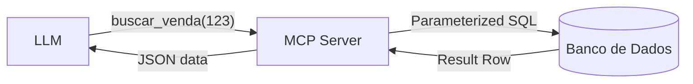

# Aula 07 - Integração com Banco de Dados 💾
## Conectando IAs ao Mundo dos Dados

---

## Agenda de Hoje 📅

1. Bancos Relacionais vs NoSQL { .fragment }
2. Segurança no Acesso de Dados { .fragment }
3. SQL Injection e Parametrização { .fragment }
4. Expondo Schemas para a IA { .fragment }
5. CRUD via MCP { .fragment }

---

## 1. O Acesso a Dados pela IA 🗄️

- IA lê o contexto (Resources). { .fragment }
- IA altera os dados (Tools). { .fragment }
- IA analisa padrões em massa. { .fragment }

---

## 2. Ameaça: SQL Injection 🛡️

- Risco de comandos maliciosos via chat. { .fragment }
- Um "prompt injection" pode virar um "SQL injection". { .fragment }

---

## 2.1 Solução: Prepared Statements

```sql
-- RUIM
"SELECT * FROM users WHERE id = " + user_input

-- BOM
"SELECT * FROM users WHERE id = ?" (param: user_input)
```

---

## 3. Prática: Busca Segura no SQLite

```python
@mcp.tool()
def buscar_cliente(nome_parcial: str):
    # Uso obrigatório de parâmetros (?)
    query = "SELECT * FROM clientes WHERE nome LIKE ?"
    return db.execute(query, (f"%{nome_parcial}%",))
```

---

## 4. Expondo o Dicionário de Dados 🔍

- A IA precisa saber as colunas existentes. { .fragment }
- Use Resources para enviar o Schema. { .fragment }
- Documente o que cada coluna significa. { .fragment }

---

## 5. Fluxo de Consulta MCP



---

## 6. Recursos (Resources) para Relatórios

- `mcp://db/estatisticas/vendas_hoje`. { .fragment }
- Perfeito para dados de leitura rápida. { .fragment }

---

## 7. O Princípio do Privilégio Mínimo 🔐

- Usuário do banco com permissões restritas. { .fragment }
- NUNCA use o usuário `root` ou `admin`. { .fragment }

---

## 8. Monitoramento e Auditoria

- Quem consultou o quê? { .fragment }
- Logs detalhados de cada Tool de banco de dados. { .fragment }

---

## 9. Paginação e Limites de Tokens

- Não envie 1 milhão de linhas para a IA. { .fragment }
- Use `LIMIT` e `OFFSET` obrigatórios. { .fragment }

---

## 10. Resumo ✅

- Segurança em primeiro lugar. { .fragment }
- Use parâmetros, nunca concatene strings. { .fragment }
- Documente o seu Schema para a IA. { .fragment }

---

## 11. Mini-Projeto: Consulta de Estoque

- Implementar uma Tool de busca em um banco fictício. { .fragment }

---

## 12. Dúvidas? 🤔

> "Dados são o novo petróleo, mas ferramentas inseguras são o fogo."
