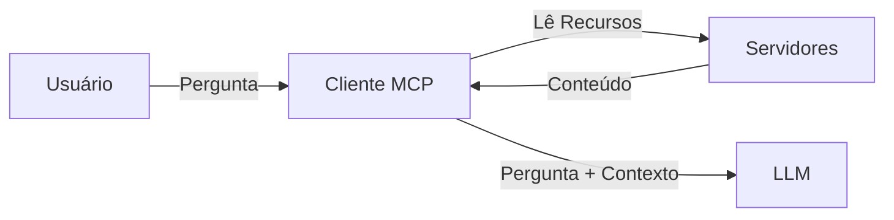
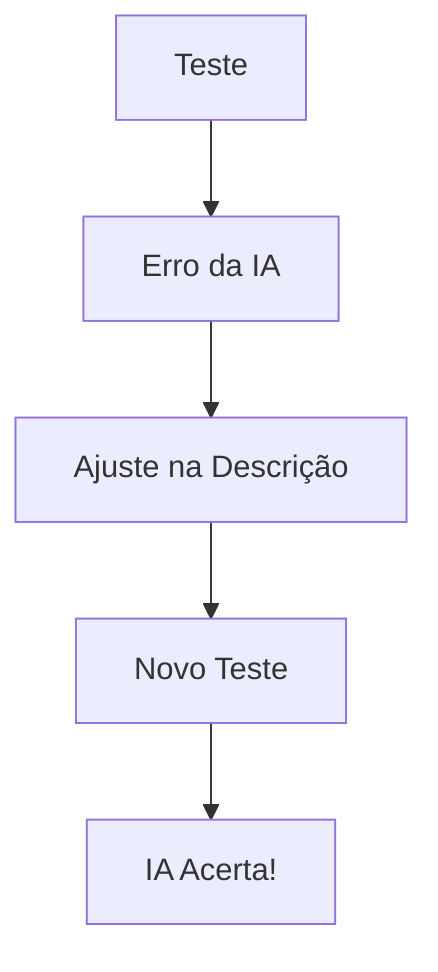

# Aula 09 - MCP e Engenharia de Prompt 🧠
## Ensinando a IA a Usar suas Ferramentas

---

## Agenda de Hoje 📅

1. O Context Window e o MCP { .fragment }
2. Escrevendo Descrições AI-Friendly { .fragment }
3. Injeção Dinâmica de Contexto { .fragment }
4. Prompt Templates do Servidor { .fragment }
5. Evitando Alucinações via MCP { .fragment }

---

## 1. O Pipeline de Contexto 🧪

- IA recebe o Prompt do Usuário. { .fragment }
- IA vê as Ferramentas disponíveis. { .fragment }
- IA escolhe quais dados de Recursos ler. { .fragment }

---

## 2. A "Janela de Contexto" 🖼️

- Espaço limitado de memória da IA (Tokens). { .fragment }
- **MCP**: Fornece apenas o dado relevante (RAG). { .fragment }

---

## 3. Escrevendo Boas Descrições ✍️

| Ruim ❌ | Bom ✅ |
| :--- | :--- |
| `get_data` | `get_user_financial_records` |
| "Busca dados" | "Busca os últimos 30 dias de transações bancárias para análise de crédito." |

---

## 4. Injeção de Recursos (Resources)

---

## 5. Prompt Templates (Modelos) 📜

- Instruções pré-definidas no servidor. { .fragment }
- Ex: "Analista de Bugs", "Escritor de BibTeX". { .fragment }
- Padronizam a saída da IA para todos os usuários. { .fragment }

---

## 6. Prática: Melhorando a Tool 💻

- Usando o Inspetor. { .fragment }
- Testando nomes e descrições diferentes. { .fragment }
- Analisando como a IA decide chamar a ferramenta. { .fragment }

---

## 7. Evitando Erros de Julgamento

- Defina exemplos claros no prompt. { .fragment }
- Explique as limitações das ferramentas. { .fragment }

---

## 8. O Ciclo de Feedback do Prompt

---

## 9. Contexto Estático vs Dinâmico

- **Estático**: Manual do sistema. { .fragment }
- **Dinâmico**: Saldo da conta atual. { .fragment }

---

## 10. Resumo ✅

- Descrições são instruções para a IA. { .fragment }
- Use especificidade e clareza. { .fragment }
- Prompt Templates economizam tokens. { .fragment }

---

## 11. Mini-Projeto: Refatoração de Prompt

- Transformar uma descrição técnica em uma descrição AI-Friendly. { .fragment }

---

## 12. Dúvidas? 🤔

> "A IA é tão boa quanto as instruções que você dá."
