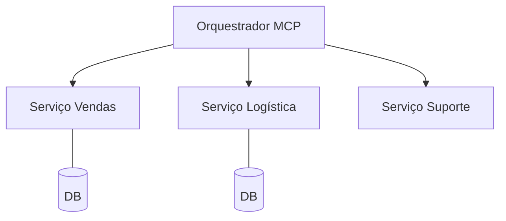

# Aula 11 - MCP e Microsserviços 🔌
## Escalando a Inteligência em Larga Escala

---

## Agenda de Hoje 📅

1. Orquestração de Múltiplos Servidores { .fragment }
2. Escalabilidade Horizontal { .fragment }
3. Observabilidade e Tracing { .fragment }
4. Service Discovery para MCP { .fragment }
5. Resiliência e Failover { .fragment }

---

## 1. O MCP no Ecossistema Corporativo 🏢

- Dezenas de microsserviços conversando. { .fragment }
- IA como interface única para dados distribuídos. { .fragment }

---

## 2. Orquestração de Agentes



---

## 3. Descoberta Automática de Ferramentas 🔍

- O Cliente MCP descobre as ferramentas na rede. { .fragment }
- Facilita a adição de novos serviços. { .fragment }

---

## 4. Tracing e Correlation IDs 🔎

- Rastrear a pergunta do usuário através dos serviços. { .fragment }
- Essencial para depurar erros em cascata. { .fragment }

---

## 5. Escalabilidade Horizontal 📈

- Múltiplas instâncias do mesmo servidor MCP. { .fragment }
- Load Balancer distribuindo as chamadas de ferramentas. { .fragment }

---

## 6. Tolerância a Falhas 🛡️

- O que acontece se o servidor de banco de dados cair? { .fragment }
- A IA deve ser informada para tentar outro caminho. { .fragment }

---

## 7. Prática: Monitor de Status 💻

```termynal
$ mcp-cluster-status
- Sales MCP: OK (10 tools)
- HR MCP: DOWN (Check connection)
```

---

## 8. Desacoplamento Total

- Mudar o BD de PostgreSQL para MongoDB sem a IA saber. { .fragment }
- O servidor MCP abstrai a tecnologia. { .fragment }

---

## 9. Resumo ✅

- Microsserviços + MCP = Máxima flexibilidade. { .fragment }
- Tracing é vital para o monitoramento. { .fragment }
- Escalar é adicionar mais "trabalhadores" (containers). { .fragment }

---

## 10. Mini-Projeto: Arquitetura em Larga Escala

- Desenhar um sistema que usa 3 microsserviços via MCP. { .fragment }

---

## 11. Dúvidas? 🤔

> "Sistemas distribuídos são difíceis; o MCP os torna inteligentes."