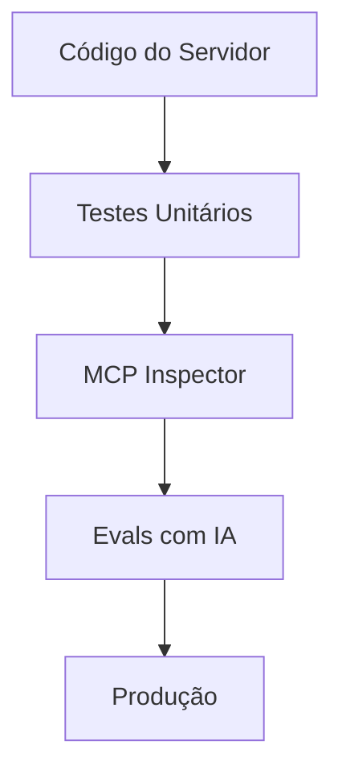

# Aula 13 - Testes e Validação 🧪
## Garantindo a Qualidade dos seus Agentes

---

## Agenda de Hoje 📅

1. Pirâmide de Testes para MCP { .fragment }
2. Testes Unitários de Ferramentas { .fragment }
3. Mocking de Clientes e Redes { .fragment }
4. Testes de IA (Evals) { .fragment }
5. Monitoramento de Saúde (Metrics) { .fragment }

---

## 1. A Camada de Testes 🏗️

- O código funciona? (Unitário). { .fragment }
- A comunicação JSON-RPC está correta? (Integração). { .fragment }
- A IA usa a ferramenta certo? (Evals). { .fragment }

---

## 2. Testes Unitários (Jest/PyTest)

```typescript
test("soma", async () => {
  expect(await soma({a:1, b:2})).toBe(3);
});
```

- Rápido, barato e essencial. { .fragment }

---

## 3. Usando o MCP Inspector 🔍

- Simular chamadas manuais. { .fragment }
- Validar o Handshake. { .fragment }
- Verificação de Schemas JSON. { .fragment }

---

## 4. O que são Evals? 🤖

- Testes de comportamento do modelo. { .fragment }
- "Se o usuário diz X, a IA deve chamar Tool Y?". { .fragment }
- Medem a precisão probabilística. { .fragment }

---

## 5. Fluxo de Validação



---

## 6. Mocking do Servidor 🎭

- Testar o Cliente sem precisar do servidor real. { .fragment }
- Útil para testar interfaces web (Aula 10). { .fragment }

---

## 7. Prática: Validando o Trigger

```termynal
$ prompt-eval "Quanto custa o dólar?"
[RESULT] IA chamou 'get_stock' (ERRO)
[RESULT] IA chamou 'get_currency' (SUCESSO)
```

---

## 8. Monitoramento e Saúde

- **Heartbeat**: "O servidor ainda responde?". { .fragment }
- **Error Rate**: Porcentagem de falhas. { .fragment }

---

## 9. Logs de Depuração (Stderr)

- Diferencie logs de dados. { .fragment }
- Ajuda a encontrar bugs "na vida real". { .fragment }

---

## 10. Resumo ✅

- Teste a lógica primeiro. { .fragment }
- Use o Inspetor para o protocolo. { .fragment }
- Use Evals para a inteligência. { .fragment }

---

## 11. Mini-Projeto: Minha Primeira Suíte

- Escrever 3 casos de teste para uma ferramenta. { .fragment }

---

## 12. Dúvidas? 🤔

> "Código não testado é código quebrado."
