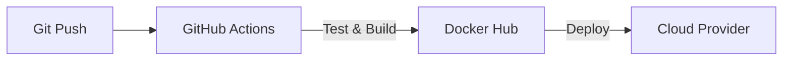

# Aula 14 - Deploy de Servidor MCP 🚢
## Do Local para a Produção

---

## Agenda de Hoje 📅

1. Dockerizando o Servidor { .fragment }
2. Gestão de Variáveis de Ambiente { .fragment }
3. CI/CD: Automatizando o Lançamento { .fragment }
4. SSE vs Stdio em Produção { .fragment }
5. Escalabilidade e Monitoramento { .fragment }

---

## 1. Por que Docker? 🐳

- Empacota tudo o que você precisa. { .fragment }
- Evita o "funciona na minha máquina". { .fragment }
- Isola o servidor do sistema do usuário. { .fragment }

---

## 2. Dockerfile MCP

```dockerfile
FROM node:20
WORKDIR /app
COPY . .
RUN npm install
CMD ["node", "dist/index.js"]
```

---

## 3. Variáveis de Ambiente (.env) 🔑

- API Keys. { .fragment }
- URLs de Banco de Dados. { .fragment }
- Jamais suba senhas no Git! { .fragment }

---

## 4. O Fluxo de CI/CD 🤖



---

## 5. SSE: Expondo via URL 🌍

- Permite que o servidor seja acessado remotamente. { .fragment }
- Use Nginx ou API Gateways. { .fragment }

---

## 6. Hospedagem na Nuvem (Cloud)

- **AWS / GCP / Azure**. { .fragment }
- **Render / Fly.io / Railway** (Recomendados). { .fragment }

---

## 7. Prática: Buildando a Imagem 💻

```termynal
$ docker build -t meu-mcp .
$ docker run -p 3000:3000 meu-mcp
```

---

## 8. Logs Centralizados (Loki/Elastic)

- Ver todos os erros em um só lugar. { .fragment }
- Essencial para escala. { .fragment }

---

## 9. Segurança de Rede (TLS/SSL)

- Sempre use HTTPS para servidores remotos. { .fragment }
- Protege o tráfego JSON-RPC. { .fragment }

---

## 10. Resumo ✅

- Docker simplifica o deploy. { .fragment }
- CI/CD garante agilidade. { .fragment }
- Segurança de chaves é obrigatória. { .fragment }

---

## 11. Mini-Projeto: Arquivo de Setup

- Criar um `docker-compose` simples. { .fragment }

---

## 12. Dúvidas? 🤔

> "Fazer deploy é uma arte; automatizá-lo é uma necessidade."
