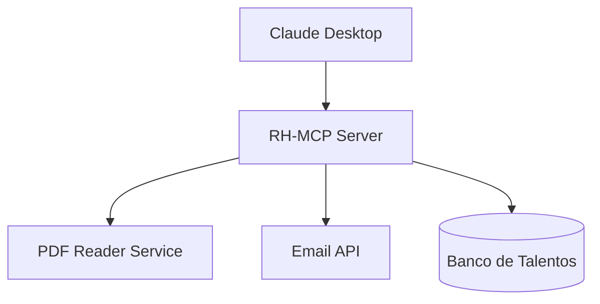

# Aula 15 - Projeto Prático Orientado 🎓
## Construindo um Sistema Inteligente Real

---

## Agenda de Hoje 📅

1. O Case: Assistente de RH Inteligente { .fragment }
2. Modelagem das Tools e Resources { .fragment }
3. Implementação Passo a Passo { .fragment }
4. Testes e Ajustes Finos { .fragment }
5. Apresentação do Resultado { .fragment }

---

## 1. O Problema a Resolver 🚩

- Grande volume de candidatos. { .fragment }
- Dificuldade em cruzar dados de currículos e vagas. { .fragment }
- Necessidade de automação de feedbacks. { .fragment }

---

## 2. Modelagem do Servidor

- **Resources**: Currículos (PDF/Text). { .fragment }
- **Tools**: Comparar currículo com vaga, Enviar e-mail. { .fragment }
- **Prompts**: Template de entrevista inicial. { .fragment }

---

## 3. Arquitetura do Projeto



---

## 4. Implementação: As Escolhas 🛠️

- Node.js + TypeScript. { .fragment }
- SQLite para o banco local. { .fragment }
- SDK MCP para as conexões. { .fragment }

---

## 5. Prática: Construindo o Código 💻

```typescript
server.tool("avaliar_perfil", { cv: z.string(), vaga: z.string() }, 
  async ({ cv, vaga }) => {
    // Lógica de comparação...
  }
);
```

---

## 6. O Teste de Turing Prático 🤖

- A IA consegue dar um feedback justo? { .fragment }
- O MCP forneceu todos os dados necessários? { .fragment }

---

## 7. Documentando seu Projeto

- `README.md` completo. { .fragment }
- Diagramas de fluxo. { .fragment }
- Instruções de uso. { .fragment }

---

## 8. Resumo ✅

- Projeto final consolida o aprendizado. { .fragment }
- Integração real é o objetivo. { .fragment }
- Documentação faz parte da engenharia. { .fragment }

---

## 9. Próxima Aula: Futuro e Tendências ✨

- O que vem depois do MCP? { .fragment }
- Ocupando o mercado de trabalho. { .fragment }

---

## 10. Dúvidas? 🤔

> "Mãos à obra! A teoria sem prática é apenas um desejo."
