# Aula 16 - Tendências e Futuro do MCP ✨
## O que Esperar da Próxima Década de IA

---

## Agenda de Hoje 📅

1. O Fim das APIs Proprietárias? { .fragment }
2. Marketplace de Servidores MCP { .fragment }
3. Agentes Autônomos e Soberania de Dados { .fragment }
4. Mercado de Trabalho: O Arquiteto de Contexto { .fragment }
5. Conclusão do Curso { .fragment }

---

## 1. O MCP como o "USB da IA" 🌍

- Padronização global. { .fragment }
- Um protocolo para todos os modelos (GPT, Claude, Llama). { .fragment }

---

## 2. A Evolução da Web: De Sites para Servidores MCP

- Em vez de "Visite nosso site", teremos "Acesse nosso servidor MCP". { .fragment }
- Serviços invisíveis consumidos por IAs pessoais. { .fragment }

---

## 3. Agentes de IA Onipresentes 🤖

```mermaid
graph LR
    User --> Assistant
    Assistant --> Home[MCP: Casa Inteligente]
    Assistant --> Work[MCP: Escritório]
    Assistant --> Bank[MCP: Financeiro]
```

---

## 4. Soberania e Privacidade 🛡️

- Rode sua própria IA localmente. { .fragment }
- Dados nunca saem do seu servidor MCP privado. { .fragment }

---

## 5. A Nova Carreira: AI Tool Engineer 👩‍💻

- Quem constrói as pontes entre modelos e realidade. { .fragment }
- Demanda crescente em todas as indústrias. { .fragment }

---

## 6. Prática: Onde Continuar? 🚀

- Repositórios oficiais no GitHub. { .fragment }
- Fóruns da Anthropic e comunidades dev. { .fragment }

---

## 7. O Futuro das IDEs

- O MCP como a base do desenvolvimento assistido por IA. { .fragment }

---

## 8. Resumo ✅

- O MCP é o início de um padrão universal. { .fragment }
- Agentes ganharão autonomia real. { .fragment }
- Você está na vanguarda desta tecnologia! { .fragment }

---

## 9. Mensagem Final 🎓

> "A inteligência artificial não vai substituir o desenvolvedor, mas o desenvolvedor que usa IA vai substituir o que não usa."

---

## Parabéns! 🥳

**Você concluiu o curso de MCP!**

- [Certificado de Conclusão]
- [Repositório do Projeto Final]

---

## Dúvidas e Networking? 👋

> "Conectar é o primeiro passo para criar."