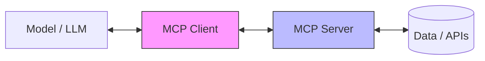
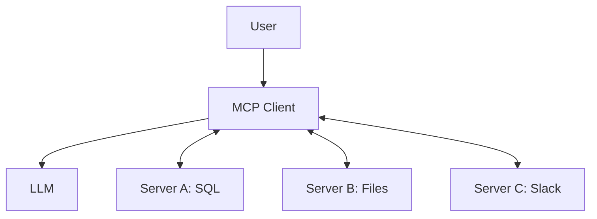

# Aula 01 - Introdução ao MCP e Arquiteturas de IA 🤖
## O Protocolo de Contexto para Modelos

---

## Agenda de Hoje 📅

1. Limitações Críticas das LLMs <!-- .element: class="fragment" -->
2. O Problema da Fragmentação de Dados <!-- .element: class="fragment" -->
3. O que é o MCP? <!-- .element: class="fragment" -->
4. Benefícios para Desenvolvedores e Empresas <!-- .element: class="fragment" -->
5. Visão Geral da Arquitetura <!-- .element: class="fragment" -->
6. Prática: Inspetor MCP <!-- .element: class="fragment" -->

---

## 1. O Desafio das LLMs Atuais 🧠

- **Isolamento**: Modelos são silos de conhecimento. <!-- .element: class="fragment" -->
- **Dados Estáticos**: Conhecimento limitado à data de corte do treino. <!-- .element: class="fragment" -->
- **Falta de Ação**: Podem sugerir, mas não agir no sistema. <!-- .element: class="fragment" -->

---

## 2. A Fragmentação de Contexto 🧩

- Cada ferramenta tem uma API diferente. <!-- .element: class="fragment" -->
- Integrações customizadas são caras e frágeis. <!-- .element: class="fragment" -->
- Dificuldade em trocar de modelo (vendor lock-in). <!-- .element: class="fragment" -->

---

## 3. A Solução: MCP 🚀

> "O Model Context Protocol é o USB para IAs."

- Padrão aberto. <!-- .element: class="fragment" -->
- Conecta modelos a dados de forma universal. <!-- .element: class="fragment" -->
- Criado pela Anthropic para o ecossistema global. <!-- .element: class="fragment" -->

---

## 3.1 Benefícios Chave

- **Interoperabilidade**: Um servidor, múltiplos modelos. <!-- .element: class="fragment" -->
- **Segurança**: Controle total sobre o que a IA acessa. <!-- .element: class="fragment" -->
- **Escalabilidade**: Adicione ferramentas sem mudar o modelo. <!-- .element: class="fragment" -->

---

## 4. O Triângulo MCP 🏗️



---

## 5. Casos de Uso Reais 💼

- Suporte ao cliente com acesso ao CRM. <!-- .element: class="fragment" -->
- Análise de código com acesso aos logs. <!-- .element: class="fragment" -->
- Automação de marketing com acesso a analytics. <!-- .element: class="fragment" -->

---

## 6. Prática: Visualizando o Fluxo 💻

- Usando o **MCP Inspector**. <!-- .element: class="fragment" -->
- Listando ferramentas. <!-- .element: class="fragment" -->
- Simulando uma chamada real. <!-- .element: class="fragment" -->

---

## 7. O Futuro dos Agentes Autônomos 🤖

- IAs que buscam, analisam e agem. <!-- .element: class="fragment" -->
- Menos "copiar e colar", mais colaboração natural. <!-- .element: class="fragment" -->

---

## 8. Arquitetura de Integração



---

## 9. MCP vs RAG Tradicional

| RAG Tradicional | MCP |
| :--- | :--- |
| Fluxo fixo e fechado | Protocolo aberto e dinâmico |
| Focado em leitura | Focado em leitura e ação |
| Integração ad-hoc | Padronização universal |

---

## 10. Ecossistema Aberto 🌐

- Open Source. <!-- .element: class="fragment" -->
- Suporte para Python e Node.js. <!-- .element: class="fragment" -->
- Crescimento comunitário acelerado. <!-- .element: class="fragment" -->

---

## 11. Segurança em Primeiro Lugar 🔐

- Camadas de autorização no Cliente. <!-- .element: class="fragment" -->
- Isolamento de processos. <!-- .element: class="fragment" -->
- Auditoria de logs de execução. <!-- .element: class="fragment" -->

---

## 12. Prática: Primeiro Contato

```termynal
$ mcp-inspect list-tools
- get_weather
- search_docs
- send_email
```

---

## 13. O Modelo Mental do Desenvolvedor

- De "Programador de APIs" para "Arquiteto de Contexto". <!-- .element: class="fragment" -->

---

## 14. Ferramentas Indispensáveis 🛠️

- SDKs oficiais. <!-- .element: class="fragment" -->
- Claud Desktop (Cliente Beta). <!-- .element: class="fragment" -->
- IDEs compatíveis. <!-- .element: class="fragment" -->

---

## 15. Mini-Projeto da Aula 🧪

- Configurar o primeiro servidor de exemplo. <!-- .element: class="fragment" -->
- Conectar ao Claude Desktop. <!-- .element: class="fragment" -->

---

## 16. Desafios de Implementação

- Latência de rede. <!-- .element: class="fragment" -->
- Ambiguidade de prompts. <!-- .element: class="fragment" -->
- Custos de tokens. <!-- .element: class="fragment" -->

---

## 17. Resumo ✅

- MCP resolve a isolação da IA. <!-- .element: class="fragment" -->
- Padroniza a troca de contexto. <!-- .element: class="fragment" -->
- É a base para a próxima geração de Agents. <!-- .element: class="fragment" -->

---

## Próxima Aula: Fundamentos de Protocolos 📡

- Como as mensagens viajam? <!-- .element: class="fragment" -->
- JSON-RPC 2.0 em detalhes. <!-- .element: class="fragment" -->

---

## Dúvidas? 🤔

> "A IA só é tão poderosa quanto o contexto que você fornece a ela."
