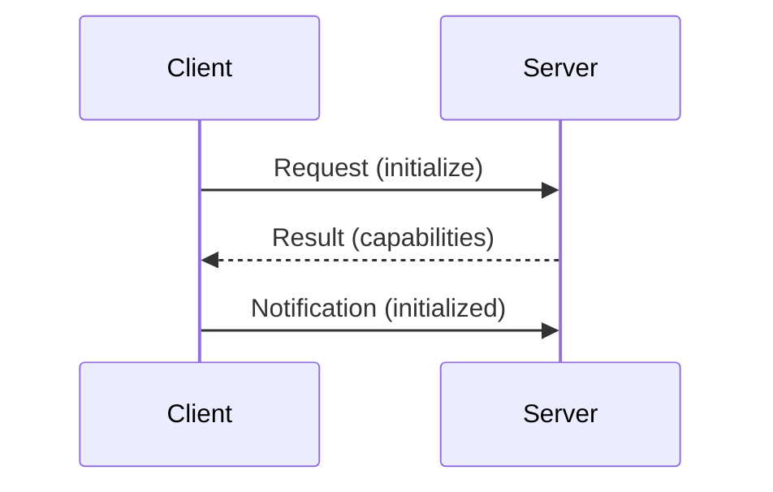

# Aula 02 - Fundamentos de Protocolos e APIs 📡
## As Bases Técnicas do MCP

---

## Agenda de Hoje 📅

1. O que é um Protocolo? <!-- .element: class="fragment" -->
2. REST vs RPC <!-- .element: class="fragment" -->
3. JSON-RPC 2.0: O Coração do MCP <!-- .element: class="fragment" -->
4. Formatos de Dados (JSON) <!-- .element: class="fragment" -->
5. Autenticação e Autorização <!-- .element: class="fragment" -->
6. Contratos de Interface <!-- .element: class="fragment" -->

---

## 1. O que é um Protocolo? 🔌

- Um conjunto de regras para comunicação. <!-- .element: class="fragment" -->
- Garante que sistemas diferentes se entendam. <!-- .element: class="fragment" -->
- Exemplo: HTTP (Web), SMTP (E-mail). <!-- .element: class="fragment" -->

---

## 2. Modelos de Comunicação 🔄

---

## 2.1 REST (Representational State Transfer) 🏛️

- Focado em **recursos** (URLs). <!-- .element: class="fragment" -->
- Verbos HTTP: GET, POST, PUT, DELETE. <!-- .element: class="fragment" -->
- Ótimo para a web tradicional. <!-- .element: class="fragment" -->

---

## 2.2 RPC (Remote Procedure Call) 🏗️

- Focado em **chamadas de função**. <!-- .element: class="fragment" -->
- "Execute isto para mim". <!-- .element: class="fragment" -->
- **MCP utiliza JSON-RPC**. <!-- .element: class="fragment" -->

---

## 3. JSON-RPC 2.0 em Detalhes 📄

```json
{
  "jsonrpc": "2.0",
  "method": "tools/call",
  "params": {
    "name": "get_weather",
    "arguments": {"city": "SP"}
  },
  "id": 1
}
```

---

## 3.1 Anatomia da Mensagem

- **method**: A ação desejada. <!-- .element: class="fragment" -->
- **params**: Os dados de entrada. <!-- .element: class="fragment" -->
- **id**: Identificador da requisição. <!-- .element: class="fragment" -->

---

## 4. Por que JSON? 💎

- Leve e legível por humanos. <!-- .element: class="fragment" -->
- Independente de linguagem. <!-- .element: class="fragment" -->
- Suporte nativo em quase todos os sistemas. <!-- .element: class="fragment" -->

---

## 5. Contrato de Interface 📜

- "Se eu te enviar X, você me responde Y". <!-- .element: class="fragment" -->
- Impede erros de processamento. <!-- .element: class="fragment" -->
- Facilita a escalabilidade. <!-- .element: class="fragment" -->

---

## 6. Fluxo de Handshake



---

## 7. Autenticação e Autorização 🔐

- **Autenticação**: "Quem é você?". <!-- .element: class="fragment" -->
- **Autorização**: "O que você pode fazer?". <!-- .element: class="fragment" -->
- Essencial para proteger dados sensíveis. <!-- .element: class="fragment" -->

---

## 8. WebSockets e SSE 🌊

- **SSE**: Servidor envia dados em fluxo (MCP remoto). <!-- .element: class="fragment" -->
- **WebSockets**: Bi-direcional em tempo real. <!-- .element: class="fragment" -->

---

## 9. Prática: Mensagem Manual 💻

```termynal
$ echo '{"jsonrpc":"2.0","method":"resources/list"}' | mcp-server
[RECV] --> {"result": {"resources": [...]}}
```

---

## 10. Tratamento de Erros no Protocolo

- Códigos de erro padrão (ex: -32601). <!-- .element: class="fragment" -->
- Mensagens claras para depuração. <!-- .element: class="fragment" -->

---

## 11. O Papel do Schema 🏗️

- Define a estrutura obrigatória. <!-- .element: class="fragment" -->
- Protege contra dados malformados. <!-- .element: class="fragment" -->

---

## 12. Comparativo Tecnológico

| REST | RPC |
| :--- | :--- |
| Resource-based | Action-based |
| Verbos HTTP | JSON-RPC Methods |
| Web Browsers | Machine-to-Machine |

---

## 13. Resumo ✅

- Protocolos são os idiomas dos sistemas. <!-- .element: class="fragment" -->
- JSON-RPC é eficiente para chamadas de IA. <!-- .element: class="fragment" -->
- Contratos de interface garantem a estabilidade. <!-- .element: class="fragment" -->

---

## 14. Mini-Projeto: Modelagem JSON

- Criar o JSON de uma ferramenta de "Consulta de CEP". <!-- .element: class="fragment" -->

---

## 15. Dúvidas? 🤔

> "Um código sem contrato é um bug esperando para acontecer."
