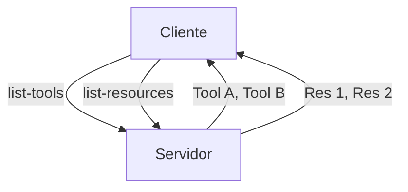
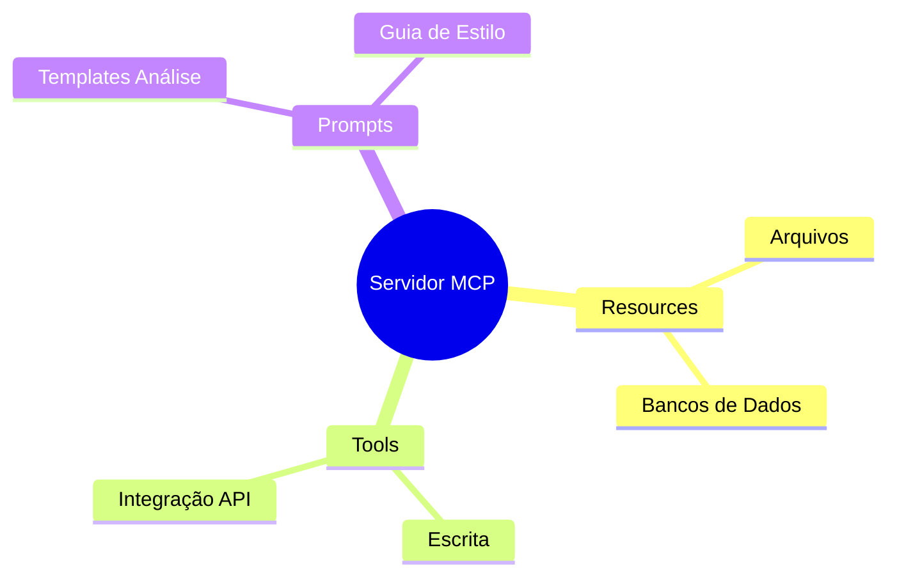

# Aula 04 - Estrutura de Recursos no MCP 📂
## Resources, Tools e Prompts

---

## Agenda de Hoje 📅

1. O que são Resources? <!-- .element: class="fragment" -->
2. O Poder das Tools <!-- .element: class="fragment" -->
3. Prompts: Templates de Inteligência <!-- .element: class="fragment" -->
4. URIs e Esquemas de Localização <!-- .element: class="fragment" -->
5. Discovery de Capacidades <!-- .element: class="fragment" -->

---

## 1. Resources (Os Dados) 💾

- Dados para **leitura**. <!-- .element: class="fragment" -->
- Podem ser estáticos ou dinâmicos. <!-- .element: class="fragment" -->
- Exemplos: Logs, bases de conhecimento, registros. <!-- .element: class="fragment" -->

---

## 1.1 Tipos de Recursos

- **Textos**: Markdown, JSON, TXT. <!-- .element: class="fragment" -->
- **Binários**: Imagens, PDFs. <!-- .element: class="fragment" -->

---

## 2. Tools (As Ações) 🛠️

- Funções que a IA pode **executar**. <!-- .element: class="fragment" -->
- Causam mudanças no sistema ou buscam dados complexos. <!-- .element: class="fragment" -->
- Ex: Enviar e-mail, salvar arquivo, deletar registro. <!-- .element: class="fragment" -->

---

## 2.1 Tool Anatomy

- **Nome**: Identificador único. <!-- .element: class="fragment" -->
- **Descrição**: Guia para o LLM. <!-- .element: class="fragment" -->
- **Input Schema**: Validação de parâmetros. <!-- .element: class="fragment" -->

---

## 3. Prompts (Instruções Reutilizáveis) 🧠

- Templates de texto para guiar o modelo. <!-- .element: class="fragment" -->
- Padronizam tarefas complexas. <!-- .element: class="fragment" -->
- Ex: "Analisar este código buscando bugs". <!-- .element: class="fragment" -->

---

## 4. O Sistema de URIs 📍

- Cada recurso tem um endereço único. <!-- .element: class="fragment" -->
- `mcp://my-server/database/users` <!-- .element: class="fragment" -->

---

## 5. Discovery (A Descoberta) 🔍



---

## 6. Definindo Tools com JSON Schema

```json
{
  "type": "object",
  "properties": {
    "amount": { "type": "number" },
    "currency": { "type": "string" }
  }
}
```

---

## 7. Recursos Dinâmicos vs Estáticos

| Estático | Dinâmico |
| :--- | :--- |
| mcp://server/manual.md | mcp://server/status/cpu |
| Conteúdo fixo | Atualizado a cada leitura |

---

## 8. Prática: Inspecionando Capacidades 💻

```termynal
$ mcp-inspect list-resources
- mcp://local/logs/error.log
- mcp://local/docs/api-guide.md
```

---

## 9. O Papel das Descrições (Engenharia de Prompt)

- "Use esta ferramenta para..." <!-- .element: class="fragment" -->
- Quanto melhor a descrição, menos a IA erra. <!-- .element: class="fragment" -->

---

## 10. Organização de Capacidades



---

## 11. Resumo ✅

- Resources = Leitura de dados via URIs. <!-- .element: class="fragment" -->
- Tools = Ações e funções parametrizadas. <!-- .element: class="fragment" -->
- Prompts = Templates de instruções para o modelo. <!-- .element: class="fragment" -->

---

## 12. Mini-Projeto: Planejamento

- Listar 1 Resource, 1 Tool e 1 Prompt para seu projeto. <!-- .element: class="fragment" -->

---

## 13. Dúvidas? 🤔

> "Resources informam, Tools agem, Prompts guiam."
