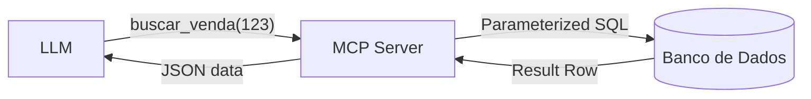

# Aula 07 - Integração com Banco de Dados 💾
## Conectando IAs ao Mundo dos Dados

---

## Agenda de Hoje 📅

1. Bancos Relacionais vs NoSQL <!-- .element: class="fragment" -->
2. Segurança no Acesso de Dados <!-- .element: class="fragment" -->
3. SQL Injection e Parametrização <!-- .element: class="fragment" -->
4. Expondo Schemas para a IA <!-- .element: class="fragment" -->
5. CRUD via MCP <!-- .element: class="fragment" -->

---

## 1. O Acesso a Dados pela IA 🗄️

- IA lê o contexto (Resources). <!-- .element: class="fragment" -->
- IA altera os dados (Tools). <!-- .element: class="fragment" -->
- IA analisa padrões em massa. <!-- .element: class="fragment" -->

---

## 2. Ameaça: SQL Injection 🛡️

- Risco de comandos maliciosos via chat. <!-- .element: class="fragment" -->
- Um "prompt injection" pode virar um "SQL injection". <!-- .element: class="fragment" -->

---

## 2.1 Solução: Prepared Statements

```sql
-- RUIM
"SELECT * FROM users WHERE id = " + user_input

-- BOM
"SELECT * FROM users WHERE id = ?" (param: user_input)
```

---

## 3. Prática: Busca Segura no SQLite

```python
@mcp.tool()
def buscar_cliente(nome_parcial: str):
    # Uso obrigatório de parâmetros (?)
    query = "SELECT * FROM clientes WHERE nome LIKE ?"
    return db.execute(query, (f"%{nome_parcial}%",))
```

---

## 4. Expondo o Dicionário de Dados 🔍

- A IA precisa saber as colunas existentes. <!-- .element: class="fragment" -->
- Use Resources para enviar o Schema. <!-- .element: class="fragment" -->
- Documente o que cada coluna significa. <!-- .element: class="fragment" -->

---

## 5. Fluxo de Consulta MCP



---

## 6. Recursos (Resources) para Relatórios

- `mcp://db/estatisticas/vendas_hoje`. <!-- .element: class="fragment" -->
- Perfeito para dados de leitura rápida. <!-- .element: class="fragment" -->

---

## 7. O Princípio do Privilégio Mínimo 🔐

- Usuário do banco com permissões restritas. <!-- .element: class="fragment" -->
- NUNCA use o usuário `root` ou `admin`. <!-- .element: class="fragment" -->

---

## 8. Monitoramento e Auditoria

- Quem consultou o quê? <!-- .element: class="fragment" -->
- Logs detalhados de cada Tool de banco de dados. <!-- .element: class="fragment" -->

---

## 9. Paginação e Limites de Tokens

- Não envie 1 milhão de linhas para a IA. <!-- .element: class="fragment" -->
- Use `LIMIT` e `OFFSET` obrigatórios. <!-- .element: class="fragment" -->

---

## 10. Resumo ✅

- Segurança em primeiro lugar. <!-- .element: class="fragment" -->
- Use parâmetros, nunca concatene strings. <!-- .element: class="fragment" -->
- Documente o seu Schema para a IA. <!-- .element: class="fragment" -->

---

## 11. Mini-Projeto: Consulta de Estoque

- Implementar uma Tool de busca em um banco fictício. <!-- .element: class="fragment" -->

---

## 12. Dúvidas? 🤔

> "Dados são o novo petróleo, mas ferramentas inseguras são o fogo."
