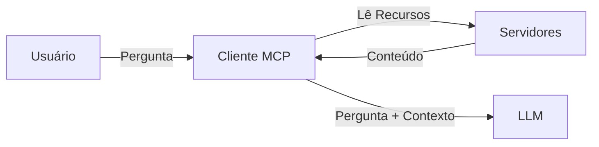
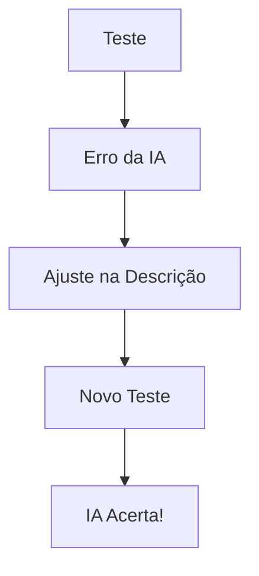

# Aula 09 - MCP e Engenharia de Prompt 🧠
## Ensinando a IA a Usar suas Ferramentas

---

## Agenda de Hoje 📅

1. O Context Window e o MCP <!-- .element: class="fragment" -->
2. Escrevendo Descrições AI-Friendly <!-- .element: class="fragment" -->
3. Injeção Dinâmica de Contexto <!-- .element: class="fragment" -->
4. Prompt Templates do Servidor <!-- .element: class="fragment" -->
5. Evitando Alucinações via MCP <!-- .element: class="fragment" -->

---

## 1. O Pipeline de Contexto 🧪

- IA recebe o Prompt do Usuário. <!-- .element: class="fragment" -->
- IA vê as Ferramentas disponíveis. <!-- .element: class="fragment" -->
- IA escolhe quais dados de Recursos ler. <!-- .element: class="fragment" -->

---

## 2. A "Janela de Contexto" 🖼️

- Espaço limitado de memória da IA (Tokens). <!-- .element: class="fragment" -->
- **MCP**: Fornece apenas o dado relevante (RAG). <!-- .element: class="fragment" -->

---

## 3. Escrevendo Boas Descrições ✍️

| Ruim ❌ | Bom ✅ |
| :--- | :--- |
| `get_data` | `get_user_financial_records` |
| "Busca dados" | "Busca os últimos 30 dias de transações bancárias para análise de crédito." |

---

## 4. Injeção de Recursos (Resources)

---

## 5. Prompt Templates (Modelos) 📜

- Instruções pré-definidas no servidor. <!-- .element: class="fragment" -->
- Ex: "Analista de Bugs", "Escritor de BibTeX". <!-- .element: class="fragment" -->
- Padronizam a saída da IA para todos os usuários. <!-- .element: class="fragment" -->

---

## 6. Prática: Melhorando a Tool 💻

- Usando o Inspetor. <!-- .element: class="fragment" -->
- Testando nomes e descrições diferentes. <!-- .element: class="fragment" -->
- Analisando como a IA decide chamar a ferramenta. <!-- .element: class="fragment" -->

---

## 7. Evitando Erros de Julgamento

- Defina exemplos claros no prompt. <!-- .element: class="fragment" -->
- Explique as limitações das ferramentas. <!-- .element: class="fragment" -->

---

## 8. O Ciclo de Feedback do Prompt

---

## 9. Contexto Estático vs Dinâmico

- **Estático**: Manual do sistema. <!-- .element: class="fragment" -->
- **Dinâmico**: Saldo da conta atual. <!-- .element: class="fragment" -->

---

## 10. Resumo ✅

- Descrições são instruções para a IA. <!-- .element: class="fragment" -->
- Use especificidade e clareza. <!-- .element: class="fragment" -->
- Prompt Templates economizam tokens. <!-- .element: class="fragment" -->

---

## 11. Mini-Projeto: Refatoração de Prompt

- Transformar uma descrição técnica em uma descrição AI-Friendly. <!-- .element: class="fragment" -->

---

## 12. Dúvidas? 🤔

> "A IA é tão boa quanto as instruções que você dá."
