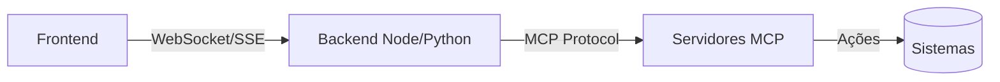
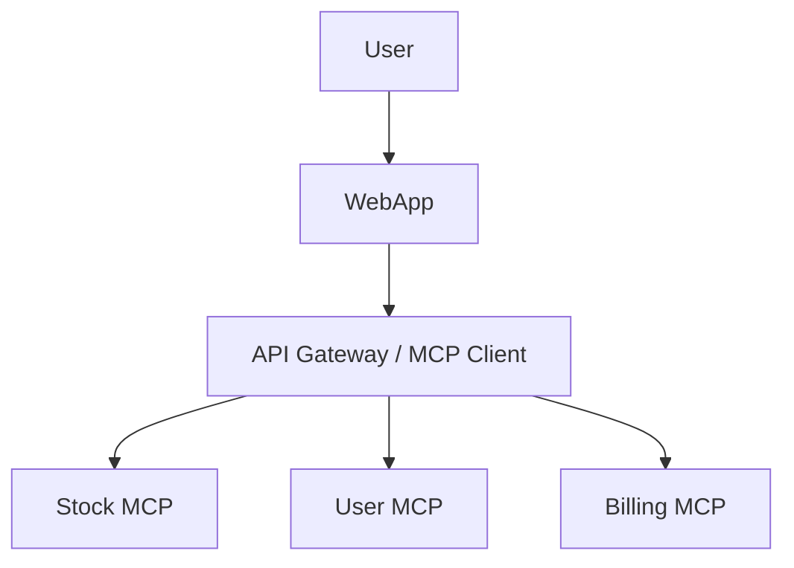

# Aula 10 - MCP com Aplicações Web 🌐
## Interfaces Modernas para Agentes de IA

---

## Agenda de Hoje 📅

1. Fluxo: Usuário -> IA -> MCP -> Web <!-- .element: class="fragment" -->
2. Web SDKs e Conectividade <!-- .element: class="fragment" -->
3. UX Transparente (Feedbacks Visuais) <!-- .element: class="fragment" -->
4. Segurança no Frontend <!-- .element: class="fragment" -->
5. Dashboards de Agents <!-- .element: class="fragment" -->

---

## 1. O MCP no Navegador 🌍

- Aplicações web "AI-First". <!-- .element: class="fragment" -->
- Conversas que resultam em ações na tela. <!-- .element: class="fragment" -->

---

## 2. A Camada de Transporte SSE

- Server-Sent Events é nativo na web. <!-- .element: class="fragment" -->
- Streaming de respostas da IA. <!-- .element: class="fragment" -->

---

## 3. UX: O Padrão "Thinking" 💭

- Mostrar que a IA está trabalhando. <!-- .element: class="fragment" -->
- "IA consultando logs..." <!-- .element: class="fragment" -->
- Melhora a percepção de utilidade. <!-- .element: class="fragment" -->

---

## 4. Segurança: Proxy e Backend 🛡️

---

## 5. Renderizando JSON de Ferramentas 🎨

- Em vez de texto bruto: Tabelas, Gráficos, Carrosséis. <!-- .element: class="fragment" -->
- Cria interfaces muito mais ricas. <!-- .element: class="fragment" -->

---

## 6. Confirmação do Usuário 👤

- Botão de "Executar Agora". <!-- .element: class="fragment" -->
- Interceptação de ferramentas destrutivas. <!-- .element: class="fragment" -->

---

## 7. Prática: Dashboard Simples 💻

- Listando ferramentas ativas em uma página web. <!-- .element: class="fragment" -->

---

## 8. Arquitetura Web Distribuída

---

## 9. Desafios de Latência

- Minimizar turnos de conversa. <!-- .element: class="fragment" -->
- Cache agressivo no lado do cliente. <!-- .element: class="fragment" -->

---

## 10. Resumo ✅

- SSE é o padrão para Web MCP. <!-- .element: class="fragment" -->
- Transparência na UX é vital. <!-- .element: class="fragment" -->
- Segurança exige backend intermediário. <!-- .element: class="fragment" -->

---

## 11. Mini-Projeto: Esboço de UI

- Desenhar uma interface de chat que usa ferramentas MCP. <!-- .element: class="fragment" -->

---

## 12. Dúvidas? 🤔

> "Interface é o que o usuário toca; Protocolo é o que faz funcionar."