# Aula 11 - MCP e Microsserviços 🔌
## Escalando a Inteligência em Larga Escala

---

## Agenda de Hoje 📅

1. Orquestração de Múltiplos Servidores <!-- .element: class="fragment" -->
2. Escalabilidade Horizontal <!-- .element: class="fragment" -->
3. Observabilidade e Tracing <!-- .element: class="fragment" -->
4. Service Discovery para MCP <!-- .element: class="fragment" -->
5. Resiliência e Failover <!-- .element: class="fragment" -->

---

## 1. O MCP no Ecossistema Corporativo 🏢

- Dezenas de microsserviços conversando. <!-- .element: class="fragment" -->
- IA como interface única para dados distribuídos. <!-- .element: class="fragment" -->

---

## 2. Orquestração de Agentes

```mermaid
graph TD
    Orch[Orquestrador MCP] --> S1[Serviço Vendas]
    Orch --> S2[Serviço Logística]
    Orch --> S3[Serviço Suporte]
    
    S1 --- D1[(DB)]
    S2 --- D2[(DB)]
```



---

## 3. Descoberta Automática de Ferramentas 🔍

- O Cliente MCP descobre as ferramentas na rede. <!-- .element: class="fragment" -->
- Facilita a adição de novos serviços. <!-- .element: class="fragment" -->

---

## 4. Tracing e Correlation IDs 🔎

- Rastrear a pergunta do usuário através dos serviços. <!-- .element: class="fragment" -->
- Essencial para depurar erros em cascata. <!-- .element: class="fragment" -->

---

## 5. Escalabilidade Horizontal 📈

- Múltiplas instâncias do mesmo servidor MCP. <!-- .element: class="fragment" -->
- Load Balancer distribuindo as chamadas de ferramentas. <!-- .element: class="fragment" -->

---

## 6. Tolerância a Falhas 🛡️

- O que acontece se o servidor de banco de dados cair? <!-- .element: class="fragment" -->
- A IA deve ser informada para tentar outro caminho. <!-- .element: class="fragment" -->

---

## 7. Prática: Monitor de Status 💻

```termynal
$ mcp-cluster-status
- Sales MCP: OK (10 tools)
- HR MCP: DOWN (Check connection)
```

---

## 8. Desacoplamento Total

- Mudar o BD de PostgreSQL para MongoDB sem a IA saber. <!-- .element: class="fragment" -->
- O servidor MCP abstrai a tecnologia. <!-- .element: class="fragment" -->

---

## 9. Resumo ✅

- Microsserviços + MCP = Máxima flexibilidade. <!-- .element: class="fragment" -->
- Tracing é vital para o monitoramento. <!-- .element: class="fragment" -->
- Escalar é adicionar mais "trabalhadores" (containers). <!-- .element: class="fragment" -->

---

## 10. Mini-Projeto: Arquitetura em Larga Escala

- Desenhar um sistema que usa 3 microsserviços via MCP. <!-- .element: class="fragment" -->

---

## 11. Dúvidas? 🤔

> "Sistemas distribuídos são difíceis; o MCP os torna inteligentes."