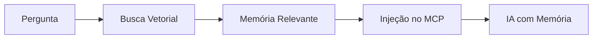
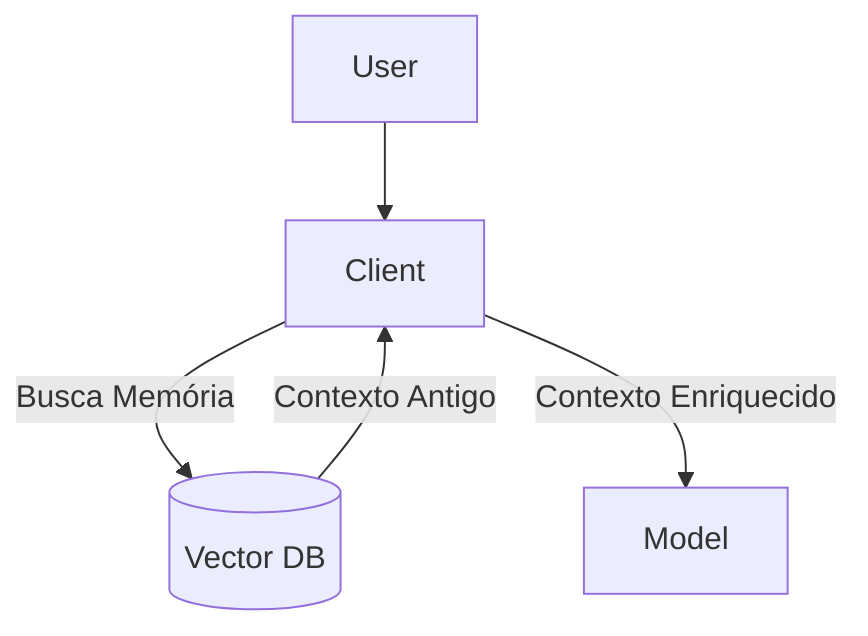

# Aula 12 - Tratamento de Estado e Contexto 🔑
## Criando Memória para suas IAs

---

## Agenda de Hoje 📅

1. Estado Transiente vs Persistente <!-- .element: class="fragment" -->
2. Gestão de Sessões <!-- .element: class="fragment" -->
3. Bases Vetoriais e Memória de Longo Prazo <!-- .element: class="fragment" -->
4. Poda de Contexto (Context Pruning) <!-- .element: class="fragment" -->
5. Summarization via MCP <!-- .element: class="fragment" -->

---

## 1. O Problema da Memória 🧠

- IAs "esquecem" turnos passados. <!-- .element: class="fragment" -->
- **Estado (State)** resolve a desorientação da IA. <!-- .element: class="fragment" -->

---

## 2. Tipos de Estado

- **Transiente**: Durante a execução (volátil). <!-- .element: class="fragment" -->
- **Persistente**: Salvo em banco de dados (durável). <!-- .element: class="fragment" -->

---

## 3. Sessões e Segurança 🛡️

- `session_id` para separar usuários. <!-- .element: class="fragment" -->
- IA não pode ler dados de outra sessão. <!-- .element: class="fragment" -->

---

## 4. Memória Semântica (Vetorial) 💾



---

## 5. Técnicas de Economia de Tokens 🎈

- **Summarization**: Resumo do histórico. <!-- .element: class="fragment" -->
- **Pruning**: Deletar o que não é mais útil. <!-- .element: class="fragment" -->

---

## 6. Prática: Persistindo Preferências 💻

```typescript
// Salva preferência do usuário na sessão
server.saveState(sessionId, { theme: "dark" });
```

---

## 7. Fluxo de Memória no MCP



---

## 8. Idempotência em Ações

- Rodar a mesma ferramenta não deve causar erros. <!-- .element: class="fragment" -->
- Crucial caso a IA repita uma tentativa. <!-- .element: class="fragment" -->

---

## 9. Resumo ✅

- Persistência dá "personalidade" à IA. <!-- .element: class="fragment" -->
- Separe contextos por usuários (Sessões). <!-- .element: class="fragment" -->
- Gerencie a Janela de Contexto com sabedoria. <!-- .element: class="fragment" -->

---

## 10. Mini-Projeto: Memória de Preferências

- Implementar uma Tool que "lembra" o nome do usuário. <!-- .element: class="fragment" -->

---

## 11. Dúvidas? 🤔

> "Conhecimento é saber o que dizer; Memória é saber a quem dizer."