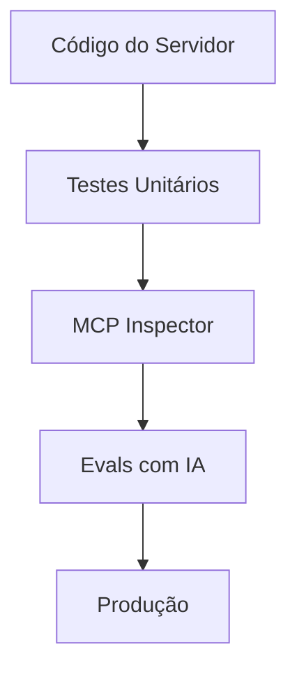

# Aula 13 - Testes e Validação 🧪
## Garantindo a Qualidade dos seus Agentes

---

## Agenda de Hoje 📅

1. Pirâmide de Testes para MCP <!-- .element: class="fragment" -->
2. Testes Unitários de Ferramentas <!-- .element: class="fragment" -->
3. Mocking de Clientes e Redes <!-- .element: class="fragment" -->
4. Testes de IA (Evals) <!-- .element: class="fragment" -->
5. Monitoramento de Saúde (Metrics) <!-- .element: class="fragment" -->

---

## 1. A Camada de Testes 🏗️

- O código funciona? (Unitário). <!-- .element: class="fragment" -->
- A comunicação JSON-RPC está correta? (Integração). <!-- .element: class="fragment" -->
- A IA usa a ferramenta certo? (Evals). <!-- .element: class="fragment" -->

---

## 2. Testes Unitários (Jest/PyTest)

```typescript
test("soma", async () => {
  expect(await soma({a:1, b:2})).toBe(3);
});
```

- Rápido, barato e essencial. <!-- .element: class="fragment" -->

---

## 3. Usando o MCP Inspector 🔍

- Simular chamadas manuais. <!-- .element: class="fragment" -->
- Validar o Handshake. <!-- .element: class="fragment" -->
- Verificação de Schemas JSON. <!-- .element: class="fragment" -->

---

## 4. O que são Evals? 🤖

- Testes de comportamento do modelo. <!-- .element: class="fragment" -->
- "Se o usuário diz X, a IA deve chamar Tool Y?". <!-- .element: class="fragment" -->
- Medem a precisão probabilística. <!-- .element: class="fragment" -->

---

## 5. Fluxo de Validação



---

## 6. Mocking do Servidor 🎭

- Testar o Cliente sem precisar do servidor real. <!-- .element: class="fragment" -->
- Útil para testar interfaces web (Aula 10). <!-- .element: class="fragment" -->

---

## 7. Prática: Validando o Trigger

```termynal
$ prompt-eval "Quanto custa o dólar?"
[RESULT] IA chamou 'get_stock' (ERRO)
[RESULT] IA chamou 'get_currency' (SUCESSO)
```

---

## 8. Monitoramento e Saúde

- **Heartbeat**: "O servidor ainda responde?". <!-- .element: class="fragment" -->
- **Error Rate**: Porcentagem de falhas. <!-- .element: class="fragment" -->

---

## 9. Logs de Depuração (Stderr)

- Diferencie logs de dados. <!-- .element: class="fragment" -->
- Ajuda a encontrar bugs "na vida real". <!-- .element: class="fragment" -->

---

## 10. Resumo ✅

- Teste a lógica primeiro. <!-- .element: class="fragment" -->
- Use o Inspetor para o protocolo. <!-- .element: class="fragment" -->
- Use Evals para a inteligência. <!-- .element: class="fragment" -->

---

## 11. Mini-Projeto: Minha Primeira Suíte

- Escrever 3 casos de teste para uma ferramenta. <!-- .element: class="fragment" -->

---

## 12. Dúvidas? 🤔

> "Código não testado é código quebrado."
