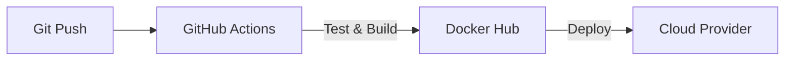

# Aula 14 - Deploy de Servidor MCP 🚢
## Do Local para a Produção

---

## Agenda de Hoje 📅

1. Dockerizando o Servidor <!-- .element: class="fragment" -->
2. Gestão de Variáveis de Ambiente <!-- .element: class="fragment" -->
3. CI/CD: Automatizando o Lançamento <!-- .element: class="fragment" -->
4. SSE vs Stdio em Produção <!-- .element: class="fragment" -->
5. Escalabilidade e Monitoramento <!-- .element: class="fragment" -->

---

## 1. Por que Docker? 🐳

- Empacota tudo o que você precisa. <!-- .element: class="fragment" -->
- Evita o "funciona na minha máquina". <!-- .element: class="fragment" -->
- Isola o servidor do sistema do usuário. <!-- .element: class="fragment" -->

---

## 2. Dockerfile MCP

```dockerfile
FROM node:20
WORKDIR /app
COPY . .
RUN npm install
CMD ["node", "dist/index.js"]
```

---

## 3. Variáveis de Ambiente (.env) 🔑

- API Keys. <!-- .element: class="fragment" -->
- URLs de Banco de Dados. <!-- .element: class="fragment" -->
- Jamais suba senhas no Git! <!-- .element: class="fragment" -->

---

## 4. O Fluxo de CI/CD 🤖



---

## 5. SSE: Expondo via URL 🌍

- Permite que o servidor seja acessado remotamente. <!-- .element: class="fragment" -->
- Use Nginx ou API Gateways. <!-- .element: class="fragment" -->

---

## 6. Hospedagem na Nuvem (Cloud)

- **AWS / GCP / Azure**. <!-- .element: class="fragment" -->
- **Render / Fly.io / Railway** (Recomendados). <!-- .element: class="fragment" -->

---

## 7. Prática: Buildando a Imagem 💻

```termynal
$ docker build -t meu-mcp .
$ docker run -p 3000:3000 meu-mcp
```

---

## 8. Logs Centralizados (Loki/Elastic)

- Ver todos os erros em um só lugar. <!-- .element: class="fragment" -->
- Essencial para escala. <!-- .element: class="fragment" -->

---

## 9. Segurança de Rede (TLS/SSL)

- Sempre use HTTPS para servidores remotos. <!-- .element: class="fragment" -->
- Protege o tráfego JSON-RPC. <!-- .element: class="fragment" -->

---

## 10. Resumo ✅

- Docker simplifica o deploy. <!-- .element: class="fragment" -->
- CI/CD garante agilidade. <!-- .element: class="fragment" -->
- Segurança de chaves é obrigatória. <!-- .element: class="fragment" -->

---

## 11. Mini-Projeto: Arquivo de Setup

- Criar um `docker-compose` simples. <!-- .element: class="fragment" -->

---

## 12. Dúvidas? 🤔

> "Fazer deploy é uma arte; automatizá-lo é uma necessidade."
