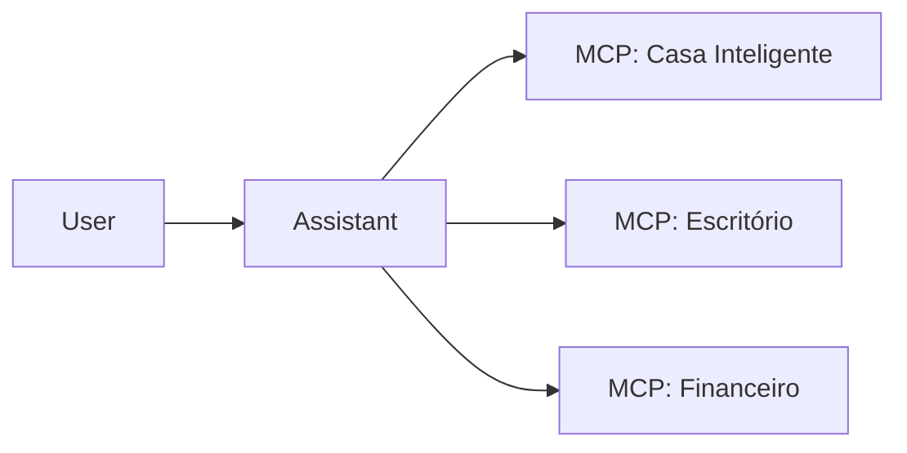

# Aula 16 - Tendências e Futuro do MCP ✨
## O que Esperar da Próxima Década de IA

---

## Agenda de Hoje 📅

1. O Fim das APIs Proprietárias? <!-- .element: class="fragment" -->
2. Marketplace de Servidores MCP <!-- .element: class="fragment" -->
3. Agentes Autônomos e Soberania de Dados <!-- .element: class="fragment" -->
4. Mercado de Trabalho: O Arquiteto de Contexto <!-- .element: class="fragment" -->
5. Conclusão do Curso <!-- .element: class="fragment" -->

---

## 1. O MCP como o "USB da IA" 🌍

- Padronização global. <!-- .element: class="fragment" -->
- Um protocolo para todos os modelos (GPT, Claude, Llama). <!-- .element: class="fragment" -->

---

## 2. A Evolução da Web: De Sites para Servidores MCP

- Em vez de "Visite nosso site", teremos "Acesse nosso servidor MCP". <!-- .element: class="fragment" -->
- Serviços invisíveis consumidos por IAs pessoais. <!-- .element: class="fragment" -->

---

## 3. Agentes de IA Onipresentes 🤖

---

## 4. Soberania e Privacidade 🛡️

- Rode sua própria IA localmente. <!-- .element: class="fragment" -->
- Dados nunca saem do seu servidor MCP privado. <!-- .element: class="fragment" -->

---

## 5. A Nova Carreira: AI Tool Engineer 👩‍💻

- Quem constrói as pontes entre modelos e realidade. <!-- .element: class="fragment" -->
- Demanda crescente em todas as indústrias. <!-- .element: class="fragment" -->

---

## 6. Prática: Onde Continuar? 🚀

- Repositórios oficiais no GitHub. <!-- .element: class="fragment" -->
- Fóruns da Anthropic e comunidades dev. <!-- .element: class="fragment" -->

---

## 7. O Futuro das IDEs

- O MCP como a base do desenvolvimento assistido por IA. <!-- .element: class="fragment" -->

---

## 8. Resumo ✅

- O MCP é o início de um padrão universal. <!-- .element: class="fragment" -->
- Agentes ganharão autonomia real. <!-- .element: class="fragment" -->
- Você está na vanguarda desta tecnologia! <!-- .element: class="fragment" -->

---

## 9. Mensagem Final 🎓

> "A inteligência artificial não vai substituir o desenvolvedor, mas o desenvolvedor que usa IA vai substituir o que não usa."

---

## Parabéns! 🥳

**Você concluiu o curso de MCP!**

- [Certificado de Conclusão]
- [Repositório do Projeto Final]

---

## Dúvidas e Networking? 👋

> "Conectar é o primeiro passo para criar."